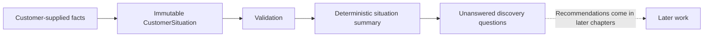

# Chapter 0: Setting Up the Sales Engineering Laboratory

## Foundations and professional practice

**Sales Engineering (SE), also called Solutions Engineering in many organizations, is the
customer-facing practice of connecting a customer's stated business context with transparent
technical evaluation and communication.** The role combines business understanding, technical
knowledge, and communication: none alone establishes whether an option fits a customer's context.

This definition is a professional-practice orientation, not a universal job specification.
Research and requirements-engineering standards inform careful evidence handling. The executable
steps in this chapter are an **educational heuristic**. Deciding which questions matter and how to
communicate uncertainty remains **subjective professional judgment**.

## Learning objectives

After this chapter, you can:

- install and inspect the laboratory;
- distinguish supplied facts, observations, and information not established;
- explain immutability and deterministic output;
- run the CLI and quality checks; and
- debug the first scenario without changing application logic.

## Purpose and boundaries

The fictional consultancy **NorthBridge Solutions** helps fictional organizations understand
operational problems and evaluate transparent technical solutions. Every organization, engagement,
number, and outcome here is fictional and educational. The laboratory turns small inputs into
inspectable artifacts so learners can compare reasoning without hidden state.

It models simplified scenarios for education and comparison. It does **not** predict whether a sale
will close, calculate lead scores or win probabilities, rank customers or employees, replace
professional judgment, or claim one technical solution is universally correct. It uses no machine
learning, generative AI, external APIs, or randomness. Stable inputs, tuple ordering, explicit
validation, and pure transformations make repeated output identical. This is reproducibility, not a
prediction of customer behavior or sales outcomes.

## Install and run

Python 3.13 is required. From the repository root:

```console
uv sync --all-extras --dev
uv run sales-lab info
uv run sales-lab chapters
uv run sales-lab examples
uv run sales-lab situation
```

With standard tooling, create a Python 3.13 virtual environment and run
`python -m pip install -e '.[dev]'`; then invoke `sales-lab`. Check the project with:

```console
uv run ruff check .
uv run ruff format --check .
uv run mypy
uv run pytest
uv build
```

## Harbor Street Music walkthrough

Harbor Street Music is a fictional community music store. During an introductory conversation it
supplied only these facts: lesson inquiries sometimes require repeated follow-up; inquiries enter a
shared spreadsheet; confirmed appointments are manually copied to a separate calendar; and no
software budget has yet been approved. The `CustomerSituation` stores those words as immutable
data. Validation rejects blank required text. The summary service preserves facts and order, while
the Markdown renderer handles presentation.

No sales-engineer observations or other established facts exist at this stage. Inquiry volume,
staff roles, duplicate-entry frequency, scheduling errors, current software capabilities, an
approved budget, and the definition of success are questions—not assumed problems. Chapter 0 does
not diagnose causes, calculate ROI, solve the situation, or recommend any software.



Future chapters can add carefully bounded practices after this evidence baseline; discovery,
requirements, architecture, proposals, and customer-success systems deliberately remain later work.

## Debugging laboratory

Open the VS Code configuration **Debug Chapter 0 Situation**, or run
`python examples/debug_chapter_0.py`. In `main`, place a breakpoint on the assignment that calls
`build_situation_summary` (search for its comment rather than relying on a line number). Step over it
and inspect `situation`, then `summary.sections`, then `report`. The tuples and supplied wording must
remain unchanged. Run twice and compare the printed reports to verify deterministic output. This
learner-owned entry point requires no edits to core logic.

## Summary

Chapter 0 establishes a local, typed, tested boundary between evidence and assumption. The first
scenario proves the laboratory can validate, structure, and display known facts without analysis or
recommendation.

## Glossary

- **Customer situation:** a bounded record of what is currently known.
- **Deterministic:** producing the same output from the same input.
- **Evidence:** information with an identified source; here, customer-supplied statements only.
- **Immutable:** unable to be changed after construction.
- **Assumption:** a proposition not yet supported by available evidence.

## References and suggested reading

- [Python documentation: `dataclasses`](https://docs.python.org/3/library/dataclasses.html)
- [Python Packaging User Guide](https://packaging.python.org/)
- [pytest documentation](https://docs.pytest.org/)
- [Ruff documentation](https://docs.astral.sh/ruff/)
- [mypy documentation](https://mypy.readthedocs.io/)
- Suggested reading: ISO/IEC/IEEE 29148, *Requirements engineering* (consult an authorized copy of
  the current standard for precise normative guidance).
