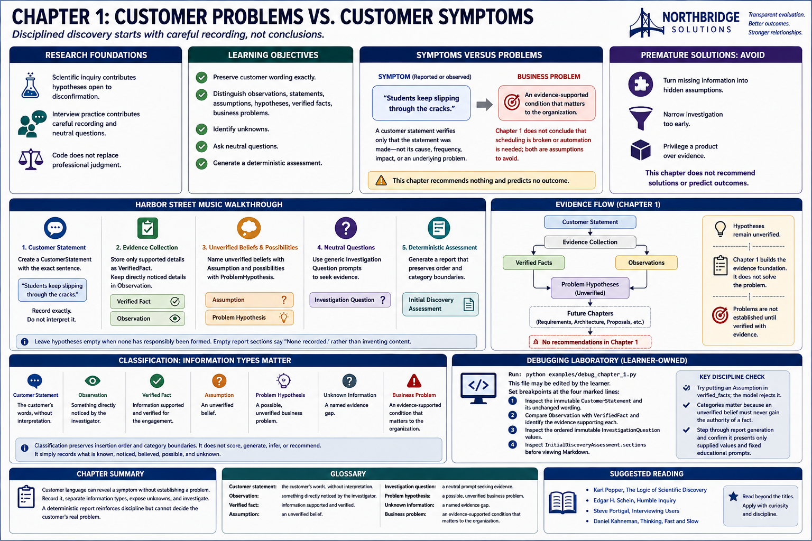
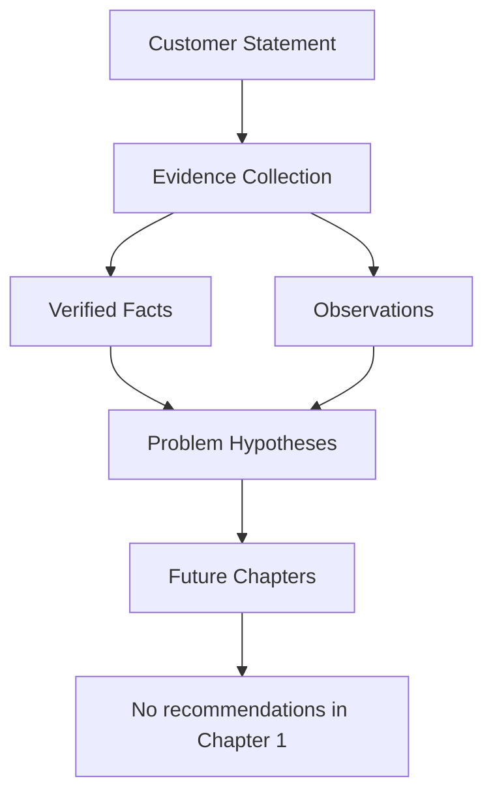

# Chapter 1: Customer Problems vs. Customer Symptoms

## Research foundations

Disciplined discovery separates what a person says, what an investigator observes, and what evidence verifies. Scientific inquiry contributes hypotheses open to disconfirmation; interview practice contributes careful recording and neutral questions. Code does not replace professional judgment.

## Learning objectives

Learners will preserve customer wording; distinguish observations, statements, assumptions, hypotheses, verified facts, and business problems; identify unknowns; ask neutral questions; and generate a deterministic assessment.

## Symptoms versus problems

A **symptom** is reported or observed. A **business problem** is an evidence-supported condition that matters to the organization. A customer statement verifies only that the statement was made—not its cause, frequency, impact, or an underlying problem.

Harbor Street Music says: **“Students keep slipping through the cracks.”** Record exactly `Students keep slipping through the cracks.` Do not interpret it. This chapter does not conclude that scheduling is broken or automation is needed; both are assumptions to avoid.

Premature solutions turn missing information into hidden assumptions, narrow investigation, and may privilege a product over evidence. This chapter recommends nothing and predicts no outcome.

## Harbor Street Music walkthrough

1. Create a `CustomerStatement` with the exact sentence.
2. Store only supported details as `VerifiedFact`; keep directly noticed details in `Observation`.
3. Name unverified beliefs with `Assumption` and possibilities with `ProblemHypothesis`.
4. Use generic `InvestigationQuestion` prompts to seek evidence.
5. Leave hypotheses empty when none has responsibly been formed.

Classification preserves insertion order and category boundaries. It does not score, generate, infer, or recommend. Empty report sections say `None recorded.` rather than inventing content.

## Evidence flow

Hypotheses remain unverified. Requirements, stakeholders, ROI, architecture, proposals, and implementation planning belong to later work.

## Debugging laboratory

Run `python examples/debug_chapter_1.py` in a debugger. This learner-owned file may be edited. Place breakpoints at the four marked lines:

1. inspect the immutable `CustomerStatement` and its unchanged wording;
2. compare `Observation` with `VerifiedFact` and identify the evidence supporting each;
3. inspect the ordered immutable `InvestigationQuestion` values; and
4. inspect `InitialDiscoveryAssessment.sections` before viewing Markdown.

Try putting an `Assumption` in `verified_facts`; the model rejects it. Categories matter because an unverified belief must never gain the authority of a fact. Step through report generation and confirm it presents only supplied values and fixed educational prompts.

## Glossary

- **Customer statement:** the customer's words, without interpretation.
- **Observation:** something directly noticed by the investigator.
- **Verified fact:** information supported and verified for the engagement.
- **Assumption:** an unverified belief.
- **Investigation question:** a neutral prompt seeking evidence.
- **Problem hypothesis:** a possible, unverified business problem.
- **Unknown information:** a named evidence gap.
- **Business problem:** an evidence-supported condition that matters to the organization; the Chapter 1 statement alone establishes none.

## Chapter summary

Customer language can reveal a symptom without establishing a problem. Record it, separate information types, expose unknowns, and investigate. A deterministic report reinforces discipline but cannot decide the customer's real problem.

## Suggested reading

- Karl Popper, *The Logic of Scientific Discovery*, on falsifiable hypotheses.
- Edgar H. Schein, *Humble Inquiry*, on curiosity-led inquiry.
- Steve Portigal, *Interviewing Users*, on interview evidence.
- Daniel Kahneman, *Thinking, Fast and Slow*, on premature judgment.
