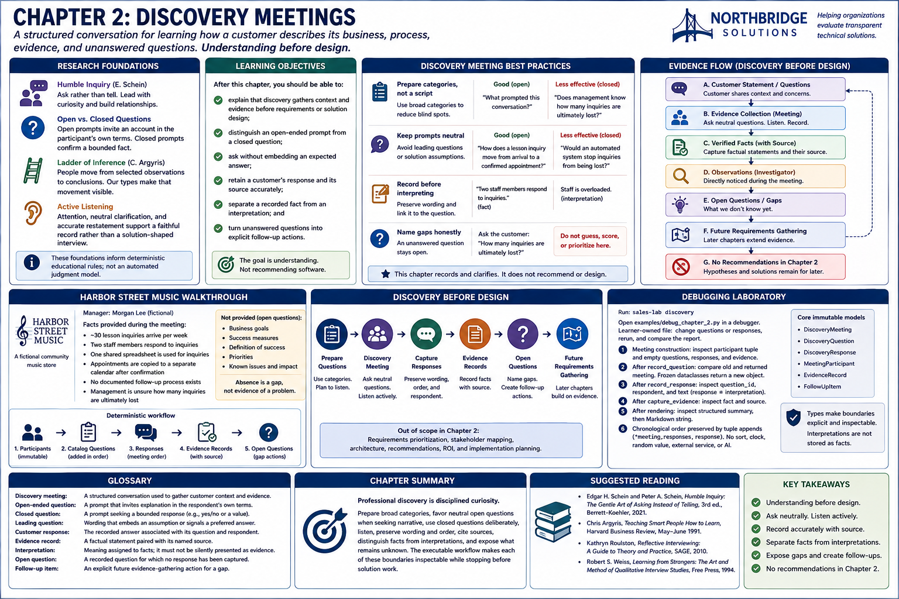
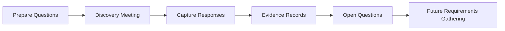

# Chapter 2: Discovery Meetings



A discovery meeting is a structured conversation for learning how a customer describes its business,
process, evidence, and unanswered questions. Its purpose is **understanding before design**. A Sales
Engineer listens, asks neutral questions, records the source of claims, and names gaps. The meeting
is not a venue for recommending software.

## Research foundations

This chapter draws on established interviewing and evidence practices:

- Edgar Schein's *Humble Inquiry* frames inquiry as asking rather than telling and emphasizes
  relationship-building curiosity.
- The open/closed question distinction from qualitative interviewing explains why open prompts
  invite an account in the participant's own terms, while closed prompts confirm a bounded fact.
- The ladder of inference, introduced by Chris Argyris and popularized in organizational learning,
  illustrates how people can move from selected observations to conclusions. Here, typed response
  and evidence records make that movement visible and discourage it.
- Active-listening practices—attention, neutral clarification, and accurate restatement—support a
  faithful record rather than a solution-shaped interview.

These foundations inform deterministic educational rules; they are not an automated judgment model.

## Learning objectives

After completing the chapter, you should be able to:

1. explain that discovery gathers context and evidence before requirements or solution design;
2. distinguish an open-ended prompt from a closed question;
3. ask without embedding an expected answer;
4. retain a customer's response and its source accurately;
5. separate a recorded fact from an interpretation; and
6. turn unanswered questions into explicit follow-up actions.

## Discovery meeting best practices

### Prepare categories, not a script to race through

The fixed catalog covers **Business Goals, Current Process, People, Technology, Data, Constraints,
and Success Measures**. Categories reduce blind spots, but listening determines the next appropriate
clarification. `What prompted this conversation?` is open-ended. `Does management know how many
inquiries are ultimately lost?` is closed: useful for confirming a bounded state, but less suited to
eliciting a narrative.

### Keep prompts neutral

Ask `How does a lesson inquiry move from arrival to a confirmed appointment?` rather than `Would
an automated system stop inquiries from being lost?` The second prompt leads the customer, assumes a
problem, and introduces a solution. Neither the catalog nor the workflow recommends a product.

### Record before interpreting

A response preserves what a participant said and links it to a question. An evidence record states a
fact and names its source. `Two staff members respond to inquiries` is supplied evidence. Claims such
as `the staff is overloaded` or `the spreadsheet causes losses` are interpretations absent supporting
evidence and therefore do not appear in the scenario.

### Name gaps honestly

An unanswered question remains open. The deterministic service generates the transparent action
`Ask the customer: …`; it does not guess an answer, score the gap, or prioritize future work.

## Harbor Street Music walkthrough

Run:

```console
sales-lab discovery
```

Morgan Lee, the fictional manager, supplies the following facts during the meeting:

- approximately 30 lesson inquiries arrive per week;
- two staff members respond to inquiries;
- one shared spreadsheet is used for inquiries;
- appointments are copied into a separate calendar after confirmation;
- no documented follow-up process exists; and
- management is unsure how many inquiries are ultimately lost.

The workflow begins with immutable participants, appends catalog questions in catalog order, appends
responses in meeting order, and then captures sourced evidence. Business goals and success measures
remain open because no responses were supplied. That absence is a gap—not evidence of a problem.
The report reflects exactly these records and limitations.

## Discovery before design



Requirements prioritization, stakeholder mapping, architecture, recommendations, ROI, and
implementation planning intentionally remain outside Chapter 2.

## Debugging laboratory

Open `examples/debug_chapter_2.py` in a debugger and run it from the repository environment.
The file is learner-owned: change the neutral question or supplied response, rerun it, and compare
the report.

Recommended breakpoints:

1. **Meeting construction:** inspect the participant tuple and the empty question, response, and
   evidence tuples.
2. **After `record_question`:** compare the old meeting with the returned meeting. Frozen dataclasses
   prevent reassignment; the service returns a new object.
3. **After `record_response`:** inspect `question_id`, `respondent`, and `text`. Notice that the
   response is distinct from an interpretation.
4. **After `capture_evidence`:** inspect `fact` and `source`; verify that evidence is stored separately.
5. **After rendering:** inspect the structured summary, then the Markdown string.

Chronological order is preserved by tuple append operations such as `(*meeting.responses, response)`.
No sort, clock, random value, external service, or AI model participates. Inspect
`DiscoveryMeeting`, `DiscoveryQuestion`, `DiscoveryResponse`, `MeetingParticipant`,
`EvidenceRecord`, and the generated `FollowUpItem`; each is an immutable frozen dataclass.

## Glossary

- **Discovery meeting:** a structured conversation used to gather customer context and evidence.
- **Open-ended question:** a prompt that invites explanation in the respondent's own terms.
- **Closed question:** a prompt seeking a bounded response, often yes/no or a specific value.
- **Leading question:** wording that embeds an assumption or signals a preferred answer.
- **Customer response:** the recorded answer associated with its question and respondent.
- **Evidence record:** a factual statement paired with its named source.
- **Interpretation:** meaning assigned to facts; it must not be silently presented as evidence.
- **Open question:** a recorded question for which no response has been captured.
- **Follow-up item:** an explicit future evidence-gathering action associated with a gap.

## Chapter summary

Professional discovery is disciplined curiosity. Prepare broad categories, favor neutral open
questions when seeking narrative, use closed questions deliberately, listen, preserve wording and
order, cite sources, distinguish facts from interpretations, and expose what remains unknown. The
executable workflow makes each of those boundaries inspectable while stopping before solution work.

## Suggested reading

- Edgar H. Schein and Peter A. Schein, *Humble Inquiry: The Gentle Art of Asking Instead of Telling*,
  third edition, Berrett-Koehler, 2021.
- Chris Argyris, `Teaching Smart People How to Learn`, *Harvard Business Review*, May–June 1991.
- Kathryn Roulston, *Reflective Interviewing: A Guide to Theory and Practice*, SAGE, 2010.
- Robert S. Weiss, *Learning from Strangers: The Art and Method of Qualitative Interview Studies*,
  Free Press, 1994.
