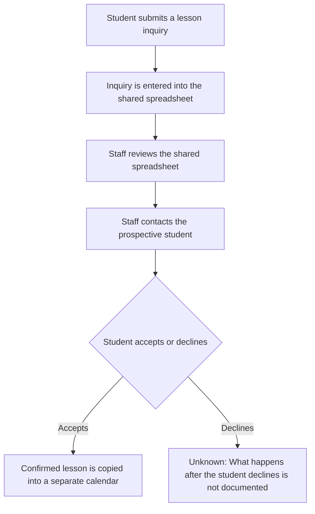

# Chapter 3: Business Process Modeling

## Learning objectives

After completing this chapter, you should be able to explain why a process is modeled; distinguish
activities from decisions; identify actors and process boundaries; trace information through a
workflow; and point to missing evidence without inventing an answer.

## Research foundations

Process modeling is a disciplined form of externalized reasoning. A visible sequence reduces the
load on working memory and gives participants a shared object to inspect. Graph concepts provide a
precise vocabulary: activities and decisions are nodes, transitions are directed edges, and reachability
shows whether every recorded node belongs to the flow. Evidence discipline adds an essential rule:
the model cannot be more certain than its source material.

This laboratory therefore treats a process model as a falsifiable record of the current state, not a
proposal. Deterministic validation makes structural errors repeatable and visible. Immutable values
preserve the original record while a learner inspects derived output.

## Professional practice

Sales Engineers model a business process to check shared understanding before discussing technology.
Use customer language, record the source of each known detail in working notes, and ask participants
to verify the boundary and sequence. An **activity** describes work that occurs. A **decision** selects
among documented paths. An **actor** participates in an activity; an information artifact is read,
created, or changed. The **boundary** states where this particular observation begins and ends.

The diagram is not evidence by itself. It is a transparent representation of evidence. A neat arrow
must never conceal an unanswered question.

## Educational heuristics

1. Prefer one observable activity per step.
2. Phrase decisions as questions and label only documented outcomes.
3. Name the actor only when the actor is documented.
4. Trace each information artifact only through steps where its use is documented.
5. Mark an unknown explicitly; do not bridge it with a plausible activity.
6. Read every transition from source to target and confirm that the recorded order is preserved.
7. Treat unreachable steps, unsupported cycles, and missing boundaries as modeling errors.

These heuristics explain a current state. They do not optimize it.

## Current-state modeling principles

`BusinessProcess` is the aggregate record. Its tuples contain immutable `ProcessStep`, `ProcessActor`,
`DecisionPoint`, `InformationArtifact`, and `WorkflowTransition` objects. `ProcessBoundary` names the
documented start and terminal steps. Validation checks unique identifiers, references, order,
reachability, cycles, and terminals before any presentation is generated.

Unknowns have two forms. An unknown step keeps a known path visible while stating what is not
documented. An incomplete transition has a documented source but no documented destination. Neither
form authorizes the service to supply a missing activity.

## Harbor Street Music walkthrough

The documented lesson-inquiry boundary begins when a prospective student submits an inquiry. Staff
enter it in a shared spreadsheet, review the spreadsheet, and contact the prospective student. The
student accepts or declines. A confirmed lesson is copied into a separate calendar. What occurs after
a decline is not documented, so the model terminates that branch in an explicit unknown rather than
calling it “closed.”

The prospective student and Harbor Street Music staff are the documented actors. The lesson inquiry,
shared spreadsheet, and separate calendar are the documented information artifacts. No owner is
assigned to the unknown outcome.



Notice what the chart does **not** say: it does not describe follow-up cadence, spreadsheet fields,
calendar ownership, handling of a declined inquiry, performance, causes, or desired improvements.

## Debugging exercise

Run:

```console
python examples/debug_chapter_3.py
```

Suggested breakpoints are the five comments in the script:

1. Inspect `process`, `process.steps`, and the frozen dataclass values.
2. Follow `transitions`, comparing each source and target with the ordered steps.
3. Step into `validate_business_process`; watch `known_steps`, `positions`, `valid_edges`, and
   `reachable`.
4. Inspect `aliases`, `decision_ids`, and `mermaid` during diagram generation.
5. Compare `model.unknown_steps`, `model.incomplete_transitions`, and `report`.

Attempting to assign to a frozen field should fail rather than alter the evidence. Without editing the
fixed input, every run should retain the same step order, terminal branches, `S1`–`S7` aliases,
unknown marker, Mermaid text, and report section order. To explore validation safely, create a separate
local process value with a duplicate identifier or invalid transition and inspect the complete friendly
error message; do not change the fixed Harbor Street Music example.

## Glossary

- **Activity:** a documented unit of work in the current process.
- **Actor:** a documented person or role participating in an activity or decision.
- **Business process:** a bounded sequence of documented activities and decisions serving a purpose.
- **Decision point:** a documented question that directs flow to labeled alternatives.
- **Information artifact:** information recorded, read, created, or updated at documented steps.
- **Process boundary:** the declared start and terminal points of the model.
- **Terminal step:** a step at which the modeled boundary ends, with no outgoing transition.
- **Transition:** a directed connection from one recorded step to another.
- **Unknown area:** information the available evidence does not establish.
- **Unreachable step:** a recorded step for which no path exists from the declared start.

## Chapter summary

A useful current-state model makes sequence, actors, decisions, boundaries, information, and missing
evidence inspectable. Structural validation prevents a polished report from hiding broken references.
Explicit unknowns protect the distinction between customer evidence and author inference. Chapter 3
ends at understanding: it does not redesign the workflow, recommend software, predict outcomes, or
estimate value.

## Suggested reading

- Object Management Group, *Business Process Model and Notation (BPMN), Version 2.0.2*, for a
  standardized process-modeling vocabulary.
- ISO 9001:2015, sections concerning the process approach and documented information.
- Donald A. Norman, *The Design of Everyday Things*, on external representations and visibility.
- Daniel Kahneman, Olivier Sibony, and Cass R. Sunstein, *Noise*, on disciplined, consistent judgment.

These sources broaden professional context. This laboratory intentionally uses a small Mermaid subset
so the executable lesson remains transparent and deterministic.
