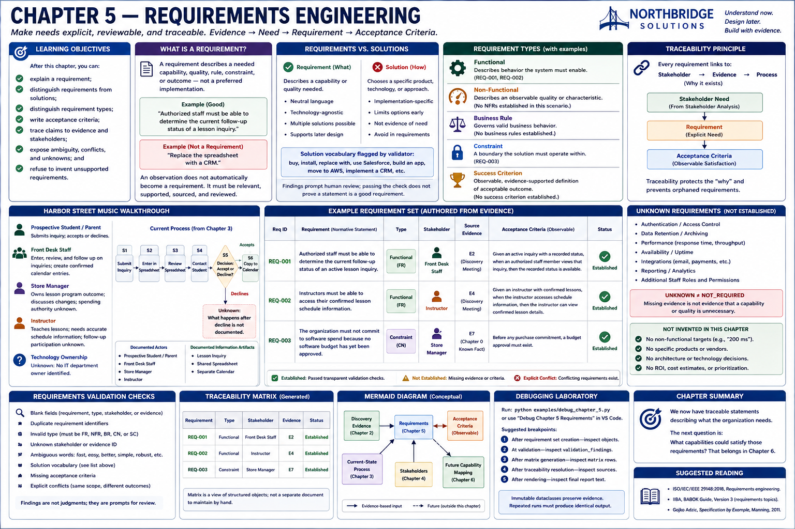
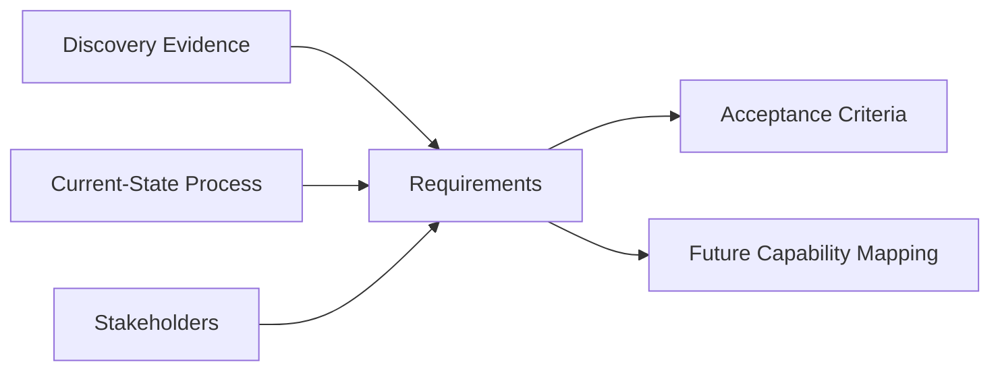

# Chapter 5 — Requirements Engineering



## Research Foundations

Requirements engineering makes needs explicit, reviewable, and traceable. ISO/IEC/IEEE 29148
provides a professional vocabulary for requirements and their life-cycle information. This chapter
uses a deliberately smaller model: evidence supports a stakeholder need, the need is expressed as a
requirement, and observable acceptance criteria clarify how people could recognize satisfaction.

## Professional Practice

A Sales Engineer asks *why does this requirement exist?* Every established requirement should point
back to named evidence and an affected stakeholder. Practitioners review statements with those
stakeholders, resolve conflicts, and keep missing information visible before considering products.

## Educational Heuristic

Use **discovery evidence → verified current process → stakeholder need → requirement → acceptance
criterion**. The executable validator checks a small, public vocabulary. It is a teaching guardrail,
not natural-language understanding.

## Subjective Professional Judgment

Determining the correct boundary, whether evidence is sufficient, and whether criteria capture the
real need requires review and judgment. Deterministic rules can reveal common drafting risks; they
cannot establish truth, importance, feasibility, or stakeholder agreement.

## Learning Objectives

After this chapter, you can explain a requirement; distinguish requirements from solutions;
distinguish functional, non-functional, business-rule, constraint, and success-criterion statements;
write acceptance criteria; trace claims to evidence and stakeholders; expose ambiguity, conflicts,
and unknowns; and refuse to invent unsupported requirements.

## What Is a Requirement?

A requirement describes a needed **capability, quality, rule, constraint, or outcome**—not a
preferred implementation. Useful forms include “The organization must…” and “Authorized staff must
be able to…”. An observation does not automatically become a requirement. It must be relevant,
supported, sourced, and reviewed.

## Requirements vs. Solutions

“Buy a CRM” and “Replace the spreadsheet with a CRM” choose implementations. “Authorized staff must
be able to determine the current follow-up status of a lesson inquiry” describes a capability.
Likewise, “The organization must maintain one identifiable current status for each active lesson
inquiry” states the need without selecting a user interface, database, vendor, or architecture.

The validator flags `buy`, `install`, `replace with`, `use Salesforce`, `build an app`, `move to AWS`,
and `implement a CRM`. Exact vocabulary checks have false positives and false negatives. A finding
prompts human review; passing the check does not prove that a statement is a good requirement.

## Functional Requirements

A functional requirement states what a process or system needs to allow someone to do. `REQ-001`
states that authorized staff must be able to determine an active inquiry's current status. It does
not say how that status is displayed or stored.

## Non-Functional Requirements

A non-functional requirement states an observable quality or operating characteristic. Words such
as “fast,” “easy,” “modern,” “better,” “user-friendly,” “seamless,” and “robust” are ambiguous
without an observable definition. Harbor Street Music supplied no supported response-time,
availability, or scale target, so this scenario establishes no non-functional requirement. It does
not invent “200 milliseconds.”

## Business Rules

A business rule governs the process or constrains valid business behavior. It is distinct from a
feature and must have evidence. No separate business rule is established in this bounded scenario.

## Constraints

A constraint defines a boundary within which options must operate. `REQ-003` preserves the Chapter 0
fact that no software budget has **yet been approved**. That does not mean the budget is `$0`, nor
does it select a free product.

## Success Criteria

A success criterion is an evidence-supported observable definition of an acceptable outcome. Because
discovery left success measures open, this scenario does not fabricate one. “No success criterion
established” is more accurate than an attractive invented metric.

## Acceptance Criteria

Acceptance criteria describe observable behavior without designing the UI or choosing technology.
For `REQ-001`: **Given** an active inquiry with a recorded status, **when** an authorized staff member
views that inquiry, **then** the recorded status is available. This criterion still requires customer
review; it does not specify screens, tables, APIs, or products.

## Evidence Traceability

The model reuses Chapter 4 evidence identifiers, which already connect roles to Chapter 3 process and
Chapter 2 discovery. `REQ-001 → Front Desk Staff → E2 → discovery meeting and process` explains why
the status capability exists. `REQ-002 → Music Instructor → E4 → lesson-operation discovery note`
explains confirmed-schedule access. `REQ-003 → Store Manager → E7 → Chapter 0 known constraint`
preserves the unapproved-budget boundary. A source identifier that does not exist produces a finding.

## Unknown Requirements

Authentication, retention, availability, and integration requirements are **NOT ESTABLISHED**.
`UNKNOWN != NOT_REQUIRED`: missing evidence is not evidence that a capability or quality is
unnecessary. Further discovery may establish a positive requirement, establish that an area does
not apply, or refine the question.

## Harbor Street Music Walkthrough

The fixed author-supplied set contains two functional capabilities and one constraint. Each has an
explicit identifier, stakeholder, existing evidence identifier, and acceptance criterion. The
service preserves supplied order and validates blanks, duplicates, evidence, stakeholder links,
ambiguity, solution vocabulary, missing criteria, and explicitly modeled conflicts. It never turns
every observation into a requirement and never generates a missing one.

## Traceability Matrix

Run `sales-lab requirements` to generate the matrix from structured objects. Its columns are
Requirement, Type, Stakeholder, Evidence, and Status. `Established` means the candidate passed the
transparent checks; it is not a claim of formal customer sign-off.

## Mermaid Diagram



The boundary is **evidence → requirement**, not **customer complaint → product**.

## Executable Example

```console
sales-lab requirements
```

The stable Markdown includes all categories (including honest empty ones), acceptance criteria,
traceability, unknown areas, findings, limitations, and the conceptual Mermaid diagram.

## Debugging Laboratory

Run `python examples/debug_chapter_5.py` or choose **Debug Chapter 5 Requirements** in VS Code. Set a
breakpoint at the marked validation assignment and inspect `requirement`, `requirement_type`,
`source_evidence`, `stakeholder`, `acceptance_criteria`, and `validation_findings`. Continue to the
matrix breakpoint and follow Discovery Evidence → Stakeholder → Requirement → Validation →
Acceptance Criterion → Traceability Matrix. Repeated runs must preserve tuple and output order.

## Exercises

1. Classify “We need Salesforce” and “Authorized staff need a shared view of the current inquiry
   status.” The first is a solution; the second is a capability candidate that still needs evidence,
   precise normative language, and criteria.
2. Classify “We need an app” and “Instructors need access to their confirmed lesson schedule.” The
   first chooses an implementation; the second states a stakeholder need.
3. Can you establish “The system must support 10,000 concurrent users” when discovery contains no
   scale evidence? **No. The requirement is not yet established.** Record the gap; do not invent a
   number.
4. Draft a criterion for schedule access without mentioning a screen, database, API, cloud, or
   vendor. Trace it to `E4`.
5. Add two candidates that explicitly conflict. Inspect `EXPLICIT_CONFLICT`; then seek stakeholder
   clarification rather than allowing code to choose a winner.

## Chapter Summary

We now have traceable statements describing what the organization needs.

The next question is: **What capabilities could satisfy those requirements?** That belongs in
Chapter 6.

## Glossary

- **Requirement:** a needed capability, quality, rule, constraint, or outcome.
- **Functional requirement:** behavior a process or system must enable.
- **Non-functional requirement:** an observable quality or operating characteristic.
- **Business rule:** a rule governing valid business behavior.
- **Constraint:** a boundary within which an option must operate.
- **Success criterion:** an observable, evidence-supported acceptable outcome.
- **Acceptance criterion:** an observable condition used to examine a requirement.
- **Traceability:** the ability to follow a claim to its stakeholder and source evidence.
- **Validation finding:** a transparent issue requiring review, not an automated judgment.
- **Unknown:** not established by available evidence; not synonymous with not required.

## References / Suggested Reading

- ISO/IEC/IEEE 29148:2018, *Systems and software engineering — Life cycle processes — Requirements
  engineering* (consult an authorized current copy for normative guidance).
- IIBA, *A Guide to the Business Analysis Body of Knowledge (BABOK Guide), Version 3*, requirements
  life-cycle and requirements-analysis material.
- Gojko Adzic, *Specification by Example*, Manning, 2011, for collaborative examples and executable
  specifications.
