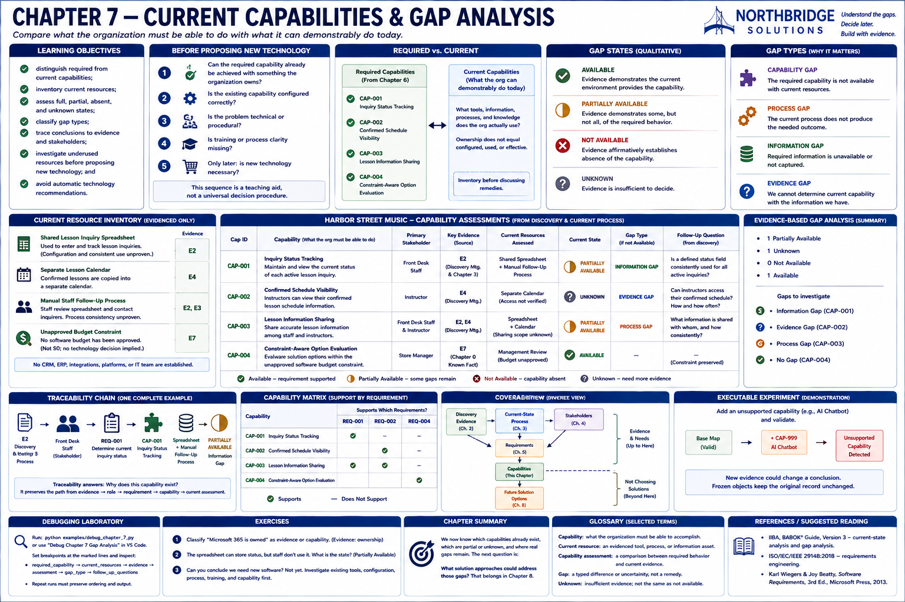
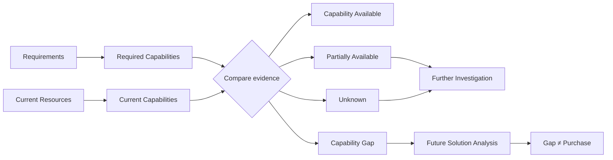

# Chapter 7 — Current Capabilities & Gap Analysis



## Research Foundations

Gap analysis compares a required state with an evidenced current state. This chapter applies that
general systems-analysis practice without turning a difference into a product decision. Evidence,
traceability, and explicit uncertainty remain the foundation established in Chapters 0–6.

## Professional Practice

A Sales Engineer inventories tools, information, processes, and organizational knowledge before
discussing remedies. They ask what is configured and consistently used, not merely what a product
could theoretically do. They preserve contradictory or missing evidence for further discovery.

## Educational Heuristic

Before proposing new technology, ask in order:

1. Can the required capability already be achieved with something the organization owns?
2. Is the existing capability configured correctly?
3. Is the problem technical or procedural?
4. Is training or process clarity missing?
5. Only later: is new technology necessary?

This sequence is a teaching aid, not a universal decision procedure.

## Subjective Professional Judgment

Evidence can establish facts, but practitioners still judge whether partial behavior is material,
what further observation is proportionate, and how to classify overlapping process and information
gaps. The enums make judgments inspectable; they do not make them objectively correct.

## Learning Objectives

Learners distinguish required from current capabilities, inventory current resources, assess full,
partial, absent, and unknown states, classify gaps, trace conclusions, investigate underused
resources, and resist automatic technology recommendations.

## Required vs. Current Capabilities

Chapter 6 says what Harbor Street Music must be able to do. Chapter 7 asks what the current
environment demonstrably does. A shared spreadsheet is a resource; **Inquiry Status Tracking** is a
capability. The former does not prove the latter.

## Current Resource Inventory

The canonical inventory contains only established resources: the shared lesson-inquiry
spreadsheet, separate lesson calendar, manual staff follow-up process, and recorded knowledge of
the unapproved-budget constraint. It invents no CRM, ERP, platform, API, infrastructure, or IT team.

## Capability Assessment

Each immutable assessment references a Chapter 6 capability, current resources, Chapter 4 evidence
identifiers and provenance, a state, rationale, and—when incomplete—a gap type and question. Input
order is normalized to the Chapter 6 capability order.

## Available vs. Partial vs. Missing vs. Unknown

- **AVAILABLE:** evidence demonstrates the current environment provides the capability.
- **PARTIALLY_AVAILABLE:** evidence demonstrates some, but not all, required behavior.
- **NOT_AVAILABLE:** evidence affirmatively establishes absence.
- **UNKNOWN:** evidence is insufficient to decide.

`UNKNOWN != NOT_AVAILABLE`. In particular, discovery has not established instructor calendar
access; it has not established that instructors lack access.

## Gap Types

- A **Capability Gap** is an evidenced absence of required capability.
- A **Process Gap** means current operation does not provide the outcome, even if a tool might.
- An **Information Gap** means required information is unavailable or not captured.
- An **Evidence Gap** means the team cannot yet determine current capability.

These classifications have different meanings and must not be collapsed into “needs software.”

## Evidence-Based Gap Analysis

The service validates all capability, resource, and evidence identifiers. Non-available assessments
must carry both a gap classification and an originating follow-up question. It derives gaps,
partials, unknowns, and questions deterministically and never emits remedies.

## Existing Technology Before New Technology

Ownership does not prove availability, configuration, adoption, permissions, data quality, or
process consistency. Existing tools, configuration, process clarity, and training deserve
investigation before new technology. A gap is an input to Chapter 8 solution analysis—not a purchase.

## Underused Capabilities

A spreadsheet may support columns, timestamps, filters, validation, and shared access. No discovery
evidence establishes that Harbor Street Music configured or consistently uses those features.
Therefore the model records the resource, leaves relevant functionality unproven, and asks whether
a defined status field is consistently used.

## Harbor Street Music Walkthrough

`CAP-001` is partially available: inquiries exist in the spreadsheet and staff follow up, but
current-status capture is not established. `CAP-002` is unknown because a separate calendar exists
but instructor access is unestablished. `CAP-003` is partial because some sharing occurs but its
cross-role reach is unproven. `CAP-004` is available because the current evidence explicitly
preserves the unapproved-budget constraint.

Run:

```console
sales-lab gaps
```

## Capability Matrix

The command generates a four-column matrix from structured objects: required capability, current
resource, current state, and distinct gap classification. It does not use scores or inferred fit.

## Traceability

One complete path is:

`E2 (discovery meeting and Chapter 3 process) → Front Desk Staff → REQ-001 → CAP-001 → Shared
Lesson Inquiry Spreadsheet + Manual Staff Follow-Up Process → PARTIALLY_AVAILABLE → INFORMATION_GAP`.

The report resolves the same identifiers rather than copying unrelated evidence prose.

## Mermaid Diagram



## Executable Experiment

The test experiment adds explicitly fictional `EXP-001`, stating that staff consistently maintain
a defined status field, and creates a new inventory. `CAP-001` changes from partial to available in
the new analysis. Frozen objects ensure the canonical analysis remains unchanged: new evidence can
change a conclusion without rewriting history.

## Debugging Laboratory

Run `python examples/debug_chapter_7.py` or select **Debug Chapter 7 Gap Analysis** in VS Code. At
the breakpoint inspect `required_capability`, `current_resources`, `evidence`, `assessment`,
`gap_type`, and `follow_up_questions` in that sequence.

## Exercises

### Exercise A

The customer owns Microsoft 365. Can you conclude it has everything required? **No.** Ownership
does not establish that capabilities exist, are configured, or are used effectively.

### Exercise B

Discovery has not determined whether instructors can access the calendar. Classify it **UNKNOWN**,
not **NOT_AVAILABLE**.

### Exercise C

The spreadsheet can technically store a status column, but staff do not use one. Does this mean
“buy new software”? **No.** It may involve process, configuration, training, or capability; further
analysis is required.

## Chapter Summary

We understand which capabilities already exist and where evidence-supported gaps remain. The next
question is: **What solution approaches could address those gaps?** That belongs in Chapter 8.

## Glossary

- **Current resource:** an evidenced tool, process, information artifact, or organizational asset.
- **Capability assessment:** an explicit comparison between required behavior and current evidence.
- **Gap:** a typed difference or uncertainty, not a remedy.
- **Underused capability:** relevant existing-resource functionality whose configuration or use
  needs investigation.
- **Evidence provenance:** the source retained with evidence so a conclusion can be audited.

## References / Suggested Reading

- International Institute of Business Analysis, *A Guide to the Business Analysis Body of
  Knowledge (BABOK Guide)*, version 3, sections on current-state analysis and gap analysis.
- ISO/IEC/IEEE 29148:2018, *Systems and software engineering — Life cycle processes — Requirements
  engineering*.
- Karl Wiegers and Joy Beatty, *Software Requirements*, third edition, Microsoft Press, 2013.
