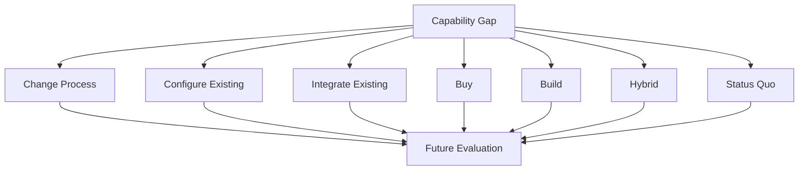

# Chapter 8 — Solution Approaches: Configure, Integrate, Buy, Build, or Change the Process

## Research Foundations

This chapter applies established requirements-engineering practices: preserve traceability, make
assumptions explicit, compare alternatives, and delay commitment until evidence supports it. The
categories here are an educational taxonomy, not a claimed universal industry standard.

## Professional Practice

A Sales Engineer should understand reasonable alternatives before advocating for one. Chapter 8
therefore asks *what broad approaches could address the established gaps?* It does not ask which
product wins. Capability first. Approach second. Product later.

## Educational Heuristic

The laboratory uses `PROCESS_CHANGE`, `CONFIGURE_EXISTING`, `INTEGRATE_EXISTING`, `BUY`, `BUILD`,
`HYBRID`, and `STATUS_QUO`. These labels make reasoning inspectable; real engagements may use other
names or combine boundaries differently.

## Subjective Professional Judgment

Deciding which alternatives deserve investigation requires judgment. The executable model does not
hide that judgment behind a numeric score. Authors must state assumptions, evidence needs,
constraints, feasibility, and qualitative tradeoff rationales.

## Learning Objectives

After this chapter you can distinguish a capability from an approach; propose several approaches to
the same gap; explain configure, integrate, buy, build, process change, and hybrid paths; retain the
status quo as a baseline; expose assumptions and evidence needs; and compare without ranking.

## From Gaps to Approaches

The reasoning chain remains connected:

`Discovery Evidence → Stakeholder Need → Requirement → Required Capability → Capability Gap → Solution Approach`

An approach without an established gap is reported as unsupported. That does not mean the idea is
bad; it means the current evidence does not justify it.

## Process Change

Change roles, training, or workflow using current resources. For inquiry-status tracking, a candidate
is a consistent manual status and follow-up practice. Its reliable adoption is not yet established.

## Configure Existing

Alter how an owned tool is set up or used. Adding a consistently maintained status field may be
possible, but the spreadsheet's controls and actual usage must be investigated first.

## Integrate Existing

Connect owned tools so information can move between them. The spreadsheet and calendar exist, but
interfaces, access, authentication, and compatible data flows are unknown. **Technical feasibility
not yet established.** Unknown does not mean not feasible.

## Buy

Evaluate commercial software capable of supplying the required capability. This is a product-neutral
candidate, not a vendor recommendation. Product research, user validation, procurement authority,
and budget evidence remain necessary.

## Build

Explore custom software. A build path may offer customization while creating delivery, technical,
and maintenance questions. Its presence in the option set does not imply desirability.

## Hybrid Approaches

Combine validated process, configuration, integration, purchase, or development elements. A hybrid
is not automatically better: each element and their interactions require evidence.

## Status Quo

Not every gap warrants intervention. Keeping the current process supplies a baseline for later
comparison of the consequence of no change against the cost and risk of change. This chapter does
not calculate either.

## Assumptions

Every candidate states an assumption and whether evidence establishes it. For configuration, the
model assumes the spreadsheet supports controlled shared editing and a usable status field; evidence
is “Not yet established,” so the state is `REQUIRES_VALIDATION`.

## Constraints

Chapter 5's `REQ-003` records that no software budget has yet been approved. This is not “budget =
$0.” It affects analysis without automatically eliminating purchase, build, or any other path.

## Feasibility

`PLAUSIBLE`, `REQUIRES_VALIDATION`, `NOT_FEASIBLE`, and `NOT_EVALUATED` prevent missing evidence
from masquerading as certainty. `NOT_FEASIBLE` requires explicit evidence of impossibility.
`UNKNOWN != NOT_FEASIBLE`.

## Tradeoffs

Dimensions include process change, effort, customization, dependency, maintenance, technical
complexity, time, and flexibility. States are qualitative: `LOW`, `MODERATE`, `HIGH`, `UNKNOWN`, or
`NOT_EVALUATED`. A rationale must explain an authored state. No totals, fit scores, or rankings exist.

## Product Neutrality

Harbor Street Music remains vendor-neutral. A commercial-system approach describes a class of
solution, not a named product. Product evaluation belongs after capability and approach reasoning.

## Harbor Street Music Walkthrough

Chapter 7 established `CAP-001` Inquiry Status Tracking as partially available with an information
gap. Chapter 8 links seven alternatives to that same identifier: standardize manual follow-up,
configure the spreadsheet, investigate integration, evaluate commercial software, develop a custom
workflow, combine approaches, or retain the current process. They are candidates, not
recommendations.

## Comparison Matrix

Run `sales-lab approaches`. The generated matrix displays use of existing tools, possible new
software, custom development, feasibility, and evidence needs. It is generated from immutable
scenario objects in authored order and declares no winner.

## Traceability

The report renders links such as `CAP-001 (Inquiry Status Tracking) → APP-002 (Configure the Existing
Spreadsheet)`. Constraint links reuse `REQ-003`. Requirements, capabilities, and gaps are not copied
into unrelated prose fields.

## Mermaid Diagram

## Executable Experiment

The debugging laboratory adds “Build a Native Mobile App” without a gap link. Validation reports an
unsupported solution approach while leaving the canonical tuple unchanged. Link the separately
created experimental candidate only after supplying an explicit requirement, capability, and gap for
mobile access; traceability then changes the validation result. The technology idea is the same—the
evidence context differs.

## Debugging Laboratory

Run `python examples/debug_chapter_8.py` or **Debug Chapter 8 Solution Approaches** in VS Code. Step
through `gap`, `approaches`, `assumptions`, `constraints`, `evidence_needs`, `feasibility`,
`tradeoffs`, validation, and comparison. Observe that the experiment creates a new option set.

## Exercises

### Exercise A

The spreadsheet lacks a consistently used status field and someone says, “You need a CRM.” What is
wrong? **Expected:** the gap may be real, but process, configuration, integration, buy, build, hybrid,
and status-quo paths require consideration.

### Exercise B

The customer owns software that may provide the capability. What happens before recommending
another product? **Expected:** investigate whether the current capability can be configured or used
effectively.

### Exercise C

Classify “Train staff on a standardized follow-up workflow.” **Expected:** process change.

### Exercise D

Classify “Connect two existing systems so confirmed appointments move automatically.” **Expected:**
integration, assuming technical feasibility is later established.

### Exercise E

Why represent the status quo? **Expected:** change has costs and risks; the existing process is an
important baseline.

## Chapter Summary

A gap can lead to several plausible approaches. Transparent assumptions, constraints, evidence
needs, feasibility states, and qualitative tradeoffs make those alternatives inspectable without
premature selection.

We have several plausible ways to address the identified capability gaps.

The next question is: **What would each approach look like as a coherent future-state solution?**
That belongs in Chapter 9.

## Glossary

- **Solution approach:** a broad candidate way to address an established capability gap.
- **Assumption:** a proposition requiring evidence before reliance.
- **Constraint:** an established boundary that affects, but need not eliminate, an option.
- **Feasibility:** the current evidence state concerning whether an approach can work.
- **Tradeoff:** a qualitative consequence considered without an aggregate score.
- **Status quo:** the current process retained as a comparison baseline.

## References / Suggested Reading

- International Institute of Business Analysis, *A Guide to the Business Analysis Body of Knowledge
  (BABOK Guide)*, sections on requirements analysis and solution evaluation.
- ISO/IEC/IEEE 29148, *Systems and software engineering — Life cycle processes — Requirements
  engineering*.
- Karl Wiegers and Joy Beatty, *Software Requirements*, Microsoft Press.
