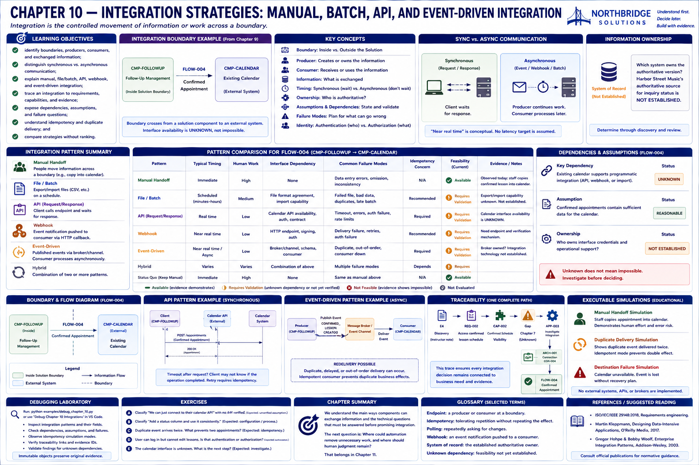

# Chapter 10 — Integration Strategies: Manual, Batch, API, and Event-Driven Integration

> Integration is the controlled movement of information or work across a boundary.

## Research Foundations

This chapter applies systems boundaries, requirements traceability, and dependable-messaging concepts. The small taxonomy is an educational model, not a universal integration standard.

## Professional Practice

A Sales Engineer identifies the producer, consumer, exchanged information, purpose, timing, ownership, dependencies, and failure questions before promising connectivity. “We integrate” is not an interface contract, and an unknown interface is not evidence that integration is impossible.

## Educational Heuristic

Start at an established architecture information flow. Compare mechanisms qualitatively, retain uncertainty, and investigate the interface rather than selecting a winner.

## Subjective Professional Judgment

The importance of latency, human effort, recovery, and operational ownership depends on customer context. The executable matrix makes these concerns inspectable; it cannot decide their priority.

## Learning Objectives

Learners will identify boundaries, producers, consumers, information, synchronous and asynchronous communication, ownership, identity questions, assumptions, dependencies, and failure modes. They will distinguish candidate feasibility from a technical promise.

## What Is Integration?

Integration is a handoff between people, processes, or systems. It may be manual, file-based, scheduled, request/response, webhook-based, event-driven, shared-data access, or hybrid. It does not automatically mean REST API.

## Integration Boundaries

Chapter 9's `FLOW-004` crosses from `CMP-FOLLOWUP` to external `CMP-CALENDAR`, carrying a Confirmed Appointment. The endpoints and information—not a preferred technology—define the boundary.

## Manual Handoffs

Staff can read confirmed lesson details and enter one calendar appointment. This is an integration: information crosses a process/system boundary. It requires little technical implementation but repeats human work, depends on discipline, and can be inconsistent. No error rate is claimed.

## File and Batch Integration

One system can export CSV or another structured file and another can import it on a schedule. Questions include validation, latency, duplicate handling, file semantics, and failed batches. The simulation does not implement file transfer.

## APIs

A client sends a request to an endpoint and receives a response. Feasibility depends on an actual interface, contract, authentication, authorization, errors, timeouts, and safe retry semantics. This chapter builds no external API.

## Webhooks

A webhook pushes a notification after an event; polling asks repeatedly whether something changed. Push reduces polling but raises delivery, verification, and consumer-availability questions.

## Event-Driven Integration

A producer publishes an event through a broker or channel for a consumer to process asynchronously. Delivery may be duplicated, delayed, or out of order. No broker infrastructure is implemented.

## Synchronous vs. Asynchronous Communication

Request/response commonly makes the client wait synchronously. Batch, webhook, and event processing can separate production from consumption in time. “Near real time” is conceptual; no invented latency target is attached.

## Data Ownership

Which system or process owns the authoritative version? `SYSTEM_OF_RECORD` is meaningful only with evidence. Harbor Street Music's authoritative source for inquiry status remains **NOT ESTABLISHED**.

## Authentication vs. Authorization

Authentication asks **who are you?** Authorization asks **what may you do?** Signing in establishes identity; permission to modify lesson schedules is an authorization concern. This chapter does not design an identity platform.

## Dependencies and Assumptions

Calendar programmatic-interface availability is an unknown dependency. “The existing calendar supports programmatic integration” is explicitly `UNVERIFIED`, never promoted to an architecture fact.

## Failure Modes

Pattern-specific considerations include invalid data, source or destination unavailability, timeouts, duplicate or out-of-order delivery, and authentication or authorization failure. Not every pattern receives every failure mode.

## Timeouts and Retries

After a timeout, the client may not know whether the operation failed or whether the server completed it and only the response was lost. Retrying therefore requires requirements and recovery decisions.

## Duplicate Delivery and Idempotency

Delivering `CONFIRMED_LESSON_CREATED` twice produces two downstream effects in the non-idempotent simulation. In the idempotent simulation, the repeated event identifier is recognized and produces no second business effect. Whether this is required must still be established.

## Harbor Street Music Walkthrough

The scenario reuses Chapter 9 `ARCH-001`, connection `CON-004`, and information flow `FLOW-004`. Manual entry is observable. File, API, webhook, and event candidates retain their unverified calendar-interface dependency rather than inventing an API.

## Pattern Comparison

Run `sales-lab integrations` to compare timing, human work, interface dependencies, failures, and feasibility. The matrix contains no numeric score and declares no winner.

## Traceability

`E4 → REQ-002 → CAP-002 → CAP-002 → APP-003 → ARCH-001 → FLOW-004 → INT-00x`

This keeps an integration strategy connected to discovery evidence rather than a disconnected idea.

## Mermaid Diagrams

The report generates a boundary flowchart, an API sequence diagram, and an event producer/channel/consumer flowchart from structured scenario data.

## Executable Simulations

`simulate_manual_handoff`, `simulate_duplicate_delivery`, and `simulate_destination_failure` expose fixed steps. They use no randomness and implement no production retry orchestration.

## Debugging Laboratory

Run `python examples/debug_chapter_10.py` or select **Debug Chapter 10 Integrations**. Step from the architecture flow through boundary, pattern, data exchange, dependency, assumption, and failure mode. Inspect `source_id`, `destination_id`, `information`, `pattern`, `direction`, `timing`, `dependencies`, `assumptions`, and `failure_modes`; then compare duplicate-delivery modes.

## Exercises

### Exercise A

“We can just connect to their calendar API,” but no API has been verified. Classify this as an **unverified integration assumption**.

### Exercise B

A confirmed-lesson event arrives twice. What business effect should occur? Investigate the idempotency requirement; do not assume it.

### Exercise C

A request times out after sending. Does the client know the server did not complete it? **Not necessarily.**

### Exercise D

A user logs in but cannot edit lesson schedules. This is primarily an **authorization** issue.

### Exercise E

Staff manually copies confirmed lessons into a calendar. Is this integration? **Yes:** it is a manual information handoff across a boundary.

## Chapter Summary

We understand the major ways components could exchange information and the technical questions that must be answered before promising an integration.

The next question is: **Where could automation remove unnecessary work, and where should human judgment remain?** That belongs in Chapter 11.

## Glossary

- **Endpoint:** a producer or consumer at an integration boundary.
- **Idempotency:** tolerating repetition without repeating the business effect.
- **Polling:** a consumer repeatedly asks a source for changes.
- **System of record:** the established authoritative owner of information.
- **Webhook:** a pushed notification sent when an event occurs.

## References / Suggested Reading

- ISO/IEC/IEEE 29148:2018, *Systems and software engineering — Life cycle processes — Requirements engineering*.
- Martin Kleppmann, *Designing Data-Intensive Applications*, O'Reilly Media, 2017.
- Gregor Hohpe and Bobby Woolf, *Enterprise Integration Patterns*, Addison-Wesley, 2003.
