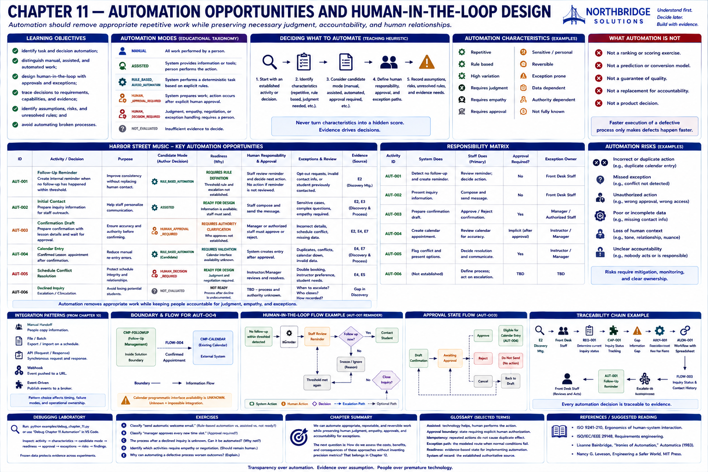

# Chapter 11 — Automation Opportunities and Human-in-the-Loop Design

> Automation should remove appropriate repetitive work while preserving necessary judgment,
> accountability, and human relationships.

## Research Foundations

This chapter draws on requirements traceability, human-centered design, dependable systems, and
process analysis. Its taxonomy is an educational model, not a universal automation standard.

## Professional Practice

A Sales Engineer makes the division of responsibility inspectable. Manual does not mean bad, and
automated does not mean good. Empathy, negotiation, professional judgment, exception handling,
approval, accountability, sensitive communication, and ambiguity can make human work essential.
Repetitive, deterministic, observable, reversible work supported by reliable data can be a useful
automation candidate.

## Educational Heuristic

Start with an established activity. Record characteristics, an explicitly authored candidate mode,
evidence, rules, data, human accountability, approvals, exceptions, risks, and unresolved questions.
Never turn the characteristics into a hidden score.

## Subjective Professional Judgment

The executable validation can expose missing evidence; it cannot decide whether automation is
desirable. Organizational values, customer relationships, risk tolerance, and professional duties
require contextual judgment.

## Learning Objectives

Learners will identify task and decision automation; human judgment; approvals; review and exception
paths; assumptions, risks, and unresolved rules; evidence traceability; and defective processes that
must be clarified before automation.

## What Is Automation?

Automation assigns bounded work to a deterministic system. The objective here is transparent
responsibility, not maximum automation. The model uses `MANUAL`, `ASSISTED`,
`RULE_BASED_AUTOMATION`, `HUMAN_APPROVAL_REQUIRED`, `HUMAN_DECISION_REQUIRED`, and
`NOT_EVALUATED`. Not evaluated means insufficient evidence; it is not another name for manual.

## Task vs. Decision Automation

Creating an internal reminder when an explicit rule is satisfied automates a task. Deciding which
people deserve a response automates a consequential judgment. This laboratory does not rank
prospective students, score leads, or predict conversion.

## Automation Characteristics

Characteristics include repetitive, rule based, high variation, requires judgment, requires empathy,
requires approval, sensitive, reversible, exception prone, and data dependent. Several can coexist;
none produces a score or candidate mode automatically.

## Manual, Assisted, and Automated Work

Manual work remains performed by a person. Assisted work presents information or reduces effort
while the person acts. Rule-based automation applies a defined deterministic rule. Approval-required
work stops until explicit approval. Decision-required work retains judgment not reduced to rules.

## Human-in-the-Loop Design

For initial contact, the candidate system presents inquiry information; staff remain responsible for
communication. For a conflict, the system identifies the condition; staff review it and decide the
response. The model also records accountability and what happens if nobody acts.

## Approval Boundaries

A drafted confirmation moves to awaiting approval. Staff may approve, reject, or cancel it. Approval
only makes it eligible to continue; the simulation performs no external action. Rejection performs no
send. An automated path may not silently cross this boundary.

## Exception Handling

The normal calendar candidate requires a confirmed, complete, non-duplicate lesson. A known schedule
conflict stops automatic completion and creates a staff review item. Exceptions are part of workflow
design rather than an afterthought.

## Automation Readiness

The transparent states are ready for design, requires rule definition, requires data validation,
requires authority clarification, not ready, and not evaluated. They are not numeric benefit scores.

## Automating Broken Processes

Undefined, inconsistent, unsupported, authority-dependent, or acceptance-criteria-free work is
`NOT_READY_FOR_AUTOMATION`. The declined-inquiry ending remains undocumented, so escalation and
closure cannot be automated. Faster execution would merely systematize the uncertainty.

## Accountability

The responsibility matrix names system work, human work, approval, and exception owner. “Human in
the loop” without these details is not an accountable design.

## Automation Risks

Risks are tied to activities: incorrect or duplicate action, missed exception, unauthorized action,
poor data, loss of human context, and unclear accountability. Automation risks are not interchangeable.

## Harbor Street Music Walkthrough

- Reminder: rule-based candidate, but its elapsed-time threshold is unresolved.
- Initial contact: assisted; staff communicate rather than an automatic message generator.
- Confirmation: draft and wait for human approval; approval authority remains to be clarified.
- Calendar entry: rule-based candidate only after confirmation, data, interface, duplicate, and
  conflict concerns are resolved.
- Conflict: human decision required under current evidence.
- Declined inquiry escalation or closure: not evaluated and not ready because the process is unknown.

An unsupported proposal to reject inquiries by predicted conversion lacks a requirement, rule, and
accountability, and inappropriately ranks people.

## Responsibility Matrix

Run `sales-lab automation`. The generated table answers what the system does, what staff review,
whether approval is required, and who owns an exception. It is generated from immutable assessments.

## Traceability

One generated chain is `E2 → review → REQ-001 → CAP-001 → CAP-003 → ARCH-001 → FLOW-003 →
reminder → AUT-001 → staff`. This reuses discovery, current process, requirements, capabilities,
architecture, and information-flow identifiers rather than recreating disconnected facts.

## Mermaid Diagrams

The report generates a human-in-the-loop reminder flow and approval state diagram from structured
assessment data. The flows expose no-action, follow-up, close, research, approval, and rejection paths.

## Executable Simulations

The reminder uses explicit booleans rather than real time: active plus threshold-satisfied creates one
reminder, and rerunning produces no duplicate business effect. Approval makes work eligible to
continue without sending. A known conflict stops completion and creates human review.

## Immutable Experiments

The excessive-automation experiment appends an unsupported fixed-period closure proposal without a
rule or authority; the original plan is unchanged. A separate fictional experiment supplies an
explicit rule and manager approval. That makes the proposal more implementable, not necessarily more
desirable.

## Debugging Laboratory

Run `python examples/debug_chapter_11.py` or select **Debug Chapter 11 Automation**. Step through
activity → characteristics → candidate mode → readiness → human responsibility → approval/exception.
Inspect `activity`, `characteristics`, `automation_mode`, `readiness`, `human_responsibility`,
`approval_boundary`, `exception_paths`, `risks`, and `validation_findings`.

## Exercises

### Exercise A

A repetitive activity occurs daily. Should it be automated? **No conclusion follows.** Rules,
exceptions, data quality, accountability, and business value also need investigation.

### Exercise B

The system drafts a response and staff decide whether to send it. Classify it as `ASSISTED` when the
person remains the actor, or `HUMAN_APPROVAL_REQUIRED` when the modeled workflow prepares work that
must cross an explicit approval boundary.

### Exercise C

There is no documented closure rule. Can closure be automated? **Not yet.** Establish the decision
rule and authority first.

### Exercise D

A conflict creates human review instead of forcing an appointment. This demonstrates **exception
routing and human judgment**.

### Exercise E

Why can automating a defective process worsen it? Defects happen faster, inconsistency becomes
systematic, accountability blurs, exceptions may be hidden, and incorrect assumptions become code.

## Chapter Summary

We understand where automation may help, where people remain responsible, and which rules and
exceptions still require clarification.

The next question is: **How should we evaluate the costs, benefits, and consequences of the candidate
approaches without fabricating precision?** That belongs in Chapter 12.

## Glossary

- **Assisted:** technology reduces effort while a person remains responsible for the action.
- **Approval boundary:** a state transition requiring explicit accountable authorization.
- **Decision automation:** a system determines a judgment outcome rather than merely doing a task.
- **Exception path:** the modeled route when normal conditions do not hold.
- **Readiness:** an evidence-based implementation-precondition state, not a desirability score.
- **Task automation:** deterministic performance of a repeatable bounded activity.

## References / Suggested Reading

- ISO 9241-210, *Ergonomics of human-system interaction — Human-centred design for interactive systems*.
- ISO/IEC/IEEE 29148, *Systems and software engineering — Life cycle processes — Requirements engineering*.
- Lisanne Bainbridge, “Ironies of Automation,” *Automatica*, 1983.
- Nancy G. Leveson, *Engineering a Safer World*, MIT Press, 2011.

Consult official publications for normative definitions; this chapter's model remains educational.
