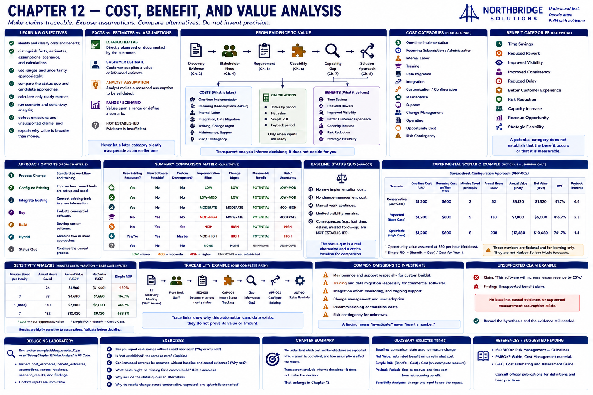
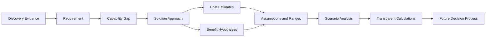

# Chapter 12 — Cost, Benefit, and Value Analysis

## Research Foundations

Value analysis applies measurement theory, requirements traceability, and basic managerial accounting. A mathematically correct result is not necessarily well supported: definitions, sources, omissions, time horizons, and causality determine whether it is useful. This chapter uses `Decimal`, immutable inputs, explicit evidence states, and deterministic calculations so every result is reproducible.

## Professional Practice

A sales engineer makes the basis of every claim inspectable, shows unknowns instead of substituting zero, separates cash flow from capacity, and gives decision-makers alternatives without manufacturing a preferred ROI. Review financial terminology with qualified finance stakeholders before production use.

## Educational Heuristic

Classify each statement as **Established Fact**, **Estimate**, **Assumption**, **Range**, **Scenario**, **Calculation**, or **Decision**. Never let a later category silently masquerade as an earlier one. The cost and benefit taxonomies here are educational rather than universal; check local accounting definitions and avoid double-counting.

## Subjective Professional Judgment

Choosing a measurement, deciding which uncertainty matters, and identifying a plausible range require judgment. Record that judgment and its source. Conservative, expected, and optimistic labels show dependence on inputs; they are not probabilities or forecasts.

## Learning Objectives

Learners will identify direct, indirect, one-time, and recurring costs; distinguish tangible and intangible value; document evidence and assumptions; use ranges; compare the status quo and candidates; calculate only ready metrics; run scenario and sensitivity analysis; detect omissions and unsupported claims; and explain why value is broader than money.

## Why Value Analysis Matters

Transparent analysis lets another person change an assumption and reproduce the result. Its purpose is informed deliberation, not persuasion. A claim of five hours saved per week remains an estimate until its baseline and measurement support are established.

## Facts, Estimates, and Assumptions

`ESTABLISHED`, `CUSTOMER_ESTIMATE`, `ANALYST_ASSUMPTION`, `EXPERIMENTAL_SCENARIO`, and `NOT_ESTABLISHED` are not interchangeable. Every estimate identifies its unit, evidence status, source or assumption, uncertainty, and trace links. Missing inputs remain missing rather than becoming zero.

## Cost Categories

The model includes `ONE_TIME_IMPLEMENTATION`, `RECURRING_SUBSCRIPTION`, `INTERNAL_LABOR`, `TRAINING`, `DATA_MIGRATION`, `INTEGRATION`, `CUSTOMIZATION`, `MAINTENANCE`, `SUPPORT`, `CHANGE_MANAGEMENT`, `OPERATING`, `OPPORTUNITY_COST`, and `RISK_CONTINGENCY`. Analysts should define boundaries—for example, ensure implementation labor is not counted again as customization.

## Benefit Categories

Potential categories are `TIME_SAVINGS`, `REDUCED_REWORK`, `IMPROVED_VISIBILITY`, `IMPROVED_CONSISTENCY`, `REDUCED_DELAY`, `BETTER_CUSTOMER_EXPERIENCE`, `RISK_REDUCTION`, `CAPACITY_INCREASE`, `REVENUE_OPPORTUNITY`, and `STRATEGIC_FLEXIBILITY`. A category does not establish occurrence. Each hypothesis records a supporting requirement or gap, measurement definition, baseline status, evidence, assumptions, and uncertainty.

## Tangible and Intangible Value

Tangible value is potentially measurable in money, hours, volume, or another defined unit. Time spent copying confirmed lessons could be measured, but it is not monetary value until an explicit value-per-hour assumption is supplied. Clearer accountability, staff confidence, visibility, onboarding, reduced frustration, and customer communication may be important intangible value. The engine refuses arbitrary amounts for intangible benefits.

## Baselines

The default comparison is `APP-007`, Continue the Current Process. It has no established new implementation or change-management cost, while manual effort, inquiry consequences, and their monetary effects remain unknown. Without current and future measurements, an improvement claim may not be measurable.

## Units and Time Horizons

Values use explicit units such as USD, hours, hours per week, inquiries per week, minutes per inquiry, percent, and count. Currency cannot be attached to a non-money unit. Recurring costs require a period; one-time costs do not. The experiment uses a one-year horizon so costs and benefits cover the same interval. Advanced discounted cash flow is intentionally absent.

## Estimate Ranges

`EstimateRange` requires nonnegative `minimum <= expected <= maximum` and never swaps invalid bounds. Prefer 8–20 hours over fake precision unless evidence supports a narrower estimate.

## Calculation Readiness

Readiness is `READY`, `PARTIALLY_READY`, `NOT_READY`, or `NOT_APPLICABLE`. Harbor Street Music is **NOT READY** for canonical ROI: baseline time, loaded labor cost, implementation effort, and recurring costs have not been established. This is a useful conclusion, not failure.

## Time Savings vs. Cash Savings

Time savings makes capacity available for other work. It becomes a cash saving only if a valid causal path to changed expenditure is established. Wage, loaded labor cost, billing rate, and opportunity value are different definitions and must not be mixed. The fictional experiment explicitly uses opportunity value.

## Avoided Cost vs. Revenue

An avoided cost may no longer occur. New revenue may occur in addition to the baseline. Protected revenue might otherwise have been lost. Each requires different evidence. The analysis does not treat every inquiry as revenue, invent conversion, or call redeployed hours payroll savings.

## Scenario Analysis

Three immutable fictional spreadsheet-configuration variants change implementation effort, recurring administration, and minutes saved. They are labeled conservative, expected, and optimistic only to expose assumption dependence. They carry no probabilities and are not Harbor Street Music forecasts. The service shows one-time cost, recurring cost, annual hours, estimated opportunity value, net value, simple ROI, and payback when inputs permit.

## Sensitivity Analysis

The experiment varies minutes saved per inquiry across 1, 3, 5, and 7 while holding all other expected-scenario inputs constant. It does not optimize or sample randomly. Hours and USD round to two decimal places using Decimal `ROUND_HALF_UP`; ROI rounds to four decimal places. This reveals which assumption materially changes the result.

## Cost of the Status Quo

Doing nothing is a real approach. It avoids new implementation and change-management costs while continuing manual work, limited visibility, unresolved handling, and reliance on current artifacts. Unknown consequences stay unknown; the chapter does not exaggerate them to favor change.

## Omitted Costs

Deterministic checks flag maintenance and support for a custom build, training and migration for commercial software, and integration effort and support for an integration approach when they have not been assessed. A finding requests investigation; it never inserts an invented amount. Decommissioning, administration, contingency, and change management should also be considered according to scope.

## Unsupported Benefit Claims

“The software will increase lesson revenue by 25%” is flagged because no baseline, causal evidence, or supported measurement assumption exists. Persuasive language and conversion assumptions cannot replace evidence. Unknown revenue impact is not calculated.

## Harbor Street Music Walkthrough

The analysis reuses the seven Chapter 8 approach objects, the status-quo baseline, `E2`, `E7`, `REQ-001`, `REQ-003`, `CAP-001`, `APP-001` through `APP-007`, and the Chapter 11 automation boundary. It establishes manual work and an unapproved software budget, then records unknown prices, labor, effort, outcome rates, and benefit measurements. No approach is recommended.

## Experimental Financial Scenario

Run `sales-lab value`. The report clearly separates canonical unknowns from three fully numerical learning experiments. The inputs—30 inquiries per week, an assumed opportunity value, implementation hours, administration hours, and minutes saved—are fictional. They demonstrate arithmetic, not customer facts or financial advice. Simple ROI is only `(benefit - cost) / cost`; payback requires positive recurring net benefit and defined timing.

## Traceability

A representative chain is `E2 → REQ-001 → CAP-001 → APP-002 → BEN-001 → Value Analysis`. Architecture and automation identifiers may also occur between the approach and assumption. Trace links explain why an estimate or hypothesis exists; they do not prove its amount.

## Mermaid Diagram

Analysis informs the future decision process; it does not make the decision automatically.

## Debugging Laboratory

Run `python examples/debug_chapter_12.py` or choose **Debug Chapter 12 Value Analysis** in VS Code. Step through Solution Approach → Cost / Benefit Inputs → Evidence Status → Range Validation → Calculation Readiness → Scenario Calculation → Sensitivity Result. Inspect `cost_estimates`, `benefit_estimates`, `assumptions`, `ranges`, `evidence_status`, `calculation_readiness`, `scenario`, `financial_metrics`, and `sensitivity_results`. Confirm that immutable inputs do not change.

## Exercises

### Exercise A
A workflow saves five employee hours each week. Can the learner report five hours of cash savings? **No, not automatically.** The business may redeploy time rather than reduce payroll expenditure.

### Exercise B
The customer has not supplied an hourly labor cost. Should the model use zero? **No.** The value remains Not Established.

### Exercise C
A salesperson claims a system will increase revenue by 30%, without baseline or causal evidence. **Flag an unsupported benefit claim.**

### Exercise D
A custom estimate includes development but no maintenance. **Flag a potential omitted recurring cost; do not invent it.**

### Exercise E
Why use conservative, expected, and optimistic scenarios? **To show how results depend on assumptions, not to predict an exact outcome.**

### Exercise F
Why can correct ROI mislead? Unsupported inputs, omitted costs, double-counted benefits, mismatched horizons, fake precision, and uncertain causality can make correct arithmetic untrustworthy.

## Chapter Summary

We now understand which cost and benefit claims are supported, which remain hypothetical, and which assumptions materially change the analysis.

The next question is: **What technical, operational, organizational, and commercial risks could affect each approach?** That belongs in Chapter 13.

## Glossary

- **Baseline:** comparison state against which change is measured.
- **Benefit hypothesis:** potential outcome awaiting measurement or stronger evidence.
- **Loaded labor cost:** wage plus applicable employer costs; not interchangeable with wage.
- **Net value:** estimated benefit minus estimated cost for a matched horizon.
- **Payback period:** time for positive recurring net benefit to recover defined one-time cost.
- **Sensitivity analysis:** deterministic variation of one supplied input while holding others fixed.
- **Simple ROI:** `(benefit - cost) / cost`; an incomplete investment measure.

## References / Suggested Reading

- International Organization for Standardization, *ISO 31000: Risk management — Guidelines* (for uncertainty and decision context).
- Project Management Institute, *A Guide to the Project Management Body of Knowledge (PMBOK Guide)* (for estimating and cost-management concepts).
- United States Government Accountability Office, *Cost Estimating and Assessment Guide* (for estimate basis, uncertainty, sensitivity, and documentation practices).
