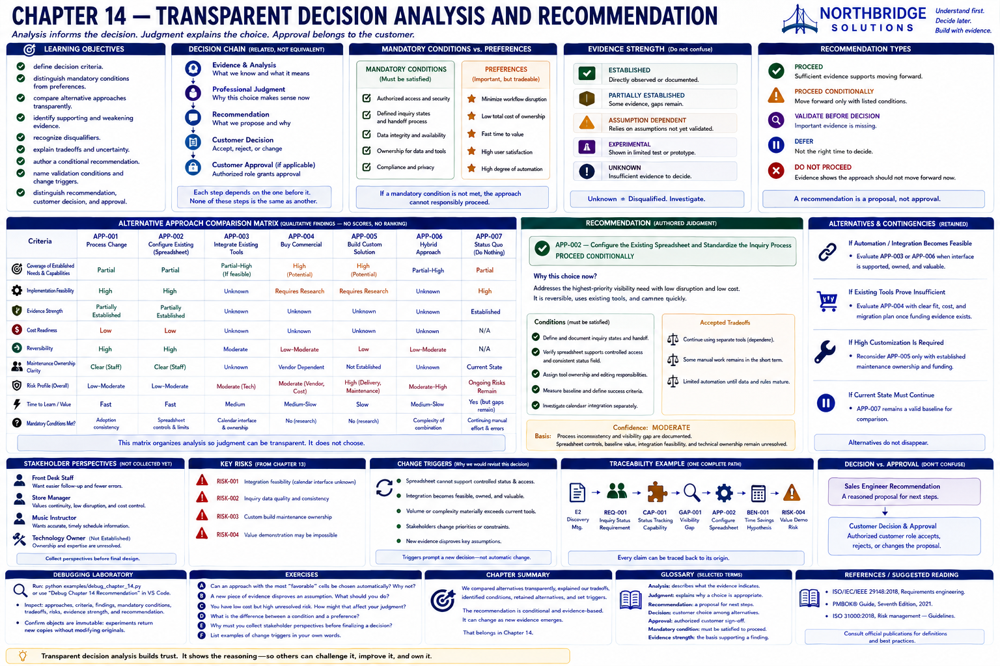
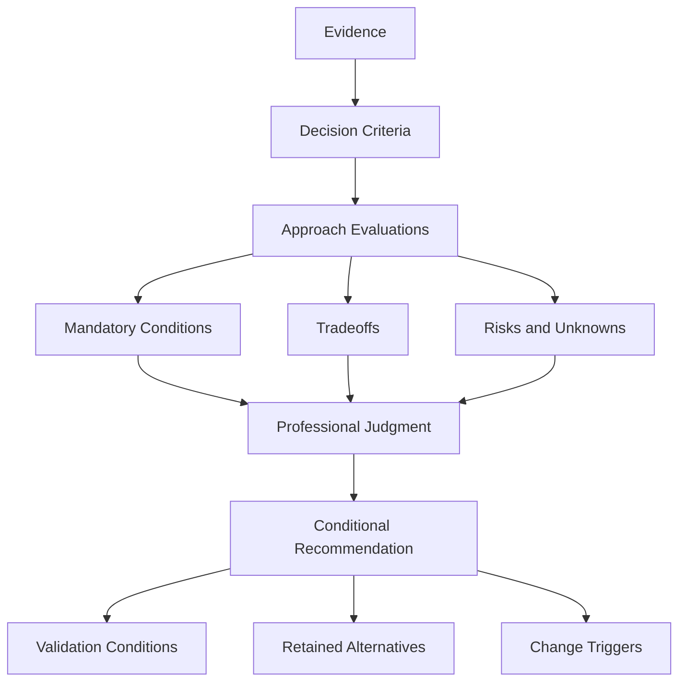

# Chapter 14 — Transparent Decision Analysis and Recommendation

## Research Foundations

Decision analysis makes alternatives, evidence, uncertainty, and values inspectable. Risk-management
and requirements-engineering practices inform traceability; multi-criteria decision analysis informs
structured comparison. This laboratory deliberately omits weighted aggregation because an authored
total could conceal value judgments and imply unsupported precision.

## Professional Practice

A recommendation is professional judgment supported by evidence. It should say what should move
forward, the need addressed, coverage, accepted tradeoffs, retained risks, unverified assumptions,
conditions, and evidence that could change it. It remains conditional and revisable.

## Educational Heuristic

Use an explicit chain: **evidence → analysis → judgment → recommendation → customer decision →
approval**. These stages are related but are not equivalent. A comparison matrix organizes analysis;
it does not decide.

## Subjective Professional Judgment

Criteria selection, risk acceptability, tradeoffs, and readiness depend on engagement context. The
program never multiplies weights, calculates aggregate fit, or declares mathematical objectivity.
Tuple order is authored for reproducibility, not rank.

## Learning Objectives

Learners can define criteria; distinguish mandatory conditions from preferences; compare approaches;
identify supporting and weakening evidence; recognize a disqualifier; explain tradeoffs; author a
conditional recommendation; preserve stakeholder uncertainty and dissent; name change triggers; and
distinguish recommendation from approval.

## What Is a Recommendation?

A recommendation is a reasoned proposal for a next step. `PROCEED` means sufficient evidence supports
the defined scope. `PROCEED_CONDITIONALLY` requires explicit conditions. It is neither a prediction nor
a customer authorization.

## Analysis vs. Judgment

Analysis describes what evidence says about alternatives. Judgment explains why selected tradeoffs
are appropriate now. The recommendation communicates that judgment. A customer decision accepts,
rejects, or changes it; an authorized customer role grants approval.

## Decision Criteria

Harbor Street uses requirement coverage, implementation feasibility, cost readiness, reversibility,
and maintenance ownership. Other modeled types include capability coverage, evidence strength,
dependency, risk, stakeholder readiness, and time to learn. These are educational and
engagement-specific—not a universal checklist, and not equally important by default.

## Mandatory Conditions vs. Preferences

A **mandatory condition** must be satisfied before an affected approach can responsibly proceed.
Authorized access and defined inquiry states are mandatory here. A **preference** may be traded against
other considerations; minimizing workflow disruption is useful but does not automatically override a
mandatory security boundary. Stakeholder desires do not become mandates merely by being stated.

## Evidence Strength

`ESTABLISHED`, `PARTIALLY_ESTABLISHED`, `ASSUMPTION_DEPENDENT`, `EXPERIMENTAL`, and `UNKNOWN` describe
the basis of a finding without a numeric score. Calendar integration feasibility is `UNKNOWN`, not
infeasible. **UNKNOWN != DISQUALIFIED.** Demonstrated violation of a mandatory condition or an
explicitly unavailable critical dependency can disqualify; missing evidence normally requires
validation.

## Tradeoffs

Configuration accepts continued dependence on separate spreadsheet and calendar resources in
exchange for limited change and reversibility. Integration may reduce duplicate handling, but adds
technical and ownership dependencies. Custom development offers control while introducing unresolved
development, cost, and maintenance responsibilities.

## Stakeholder Perspectives

Chapter 4 roles are reused. Front desk staff may value visibility, the manager may value continuity,
and instructors may value reliable schedule information. Their views have not been collected on these
alternatives, and the technology-owner role remains unestablished. The report says so rather than
inventing consensus or dissent.

## Recommendation Types

- `PROCEED`: sufficient evidence supports moving within defined scope.
- `PROCEED_CONDITIONALLY`: proceed only after or while satisfying named conditions.
- `VALIDATE_BEFORE_DECISION`: important evidence is missing, so choosing is premature.
- `DEFER`: postpone because an established timing, ownership, or funding constraint applies.
- `DO_NOT_PROCEED`: evidence shows the approach should not move forward now.

Unknown feasibility alone never means `DO_NOT_PROCEED`.

## Recommendation Confidence

Confidence is `HIGH`, `MODERATE`, `LOW`, or `NOT_ASSESSED`, always with a written basis. Harbor Street
is **moderate**: the process inconsistency and visibility gap are documented, while spreadsheet
controls, baseline value, integration feasibility, and technical ownership remain unresolved.

## Conditional Recommendations

Every `PROCEED_CONDITIONALLY` recommendation must list conditions. Harbor Street must define inquiry
states and handoff, assign ownership and editing responsibilities, verify authorized access, measure
a baseline and success criteria, and investigate calendar integration separately.

## Alternatives and Contingencies

The retained contingency is a documented manual handoff if configuration validation fails.
Integration remains a future alternative when its interface, access, duplicate handling, ownership,
and value are established. Commercial software remains available for later evaluation if current
tools prove insufficient and funding evidence emerges. Alternatives do not disappear.

## Change Triggers

Reconsider configuration if the spreadsheet cannot support controlled status and access. Evaluate
integration or hybrid if it becomes feasible, owned, and valuable. Reassess architecture when scale
materially exceeds evidence. Do not pursue custom development without maintenance ownership.

## Recommendation vs. Approval

The laboratory produces a recommendation. It does not approve the recommendation on behalf of the
fictional customer. No Sales Engineer may turn missing funding authority into customer approval.

## Harbor Street Music Walkthrough

The fixture reuses all seven Chapter 8 alternatives. Chapters 9–11 supply architecture, integration,
and automation constraints; Chapter 12 supplies incomplete baselines and value hypotheses; Chapter 13
supplies budget, ownership, integration, data, and value risks. The authored judgment recommends:

> **Proceed conditionally** with a standardized lesson-inquiry process and configuration of the
> existing spreadsheet, retaining the manual calendar handoff during an initial validation period.

This limited, reversible step addresses part of the established status-visibility need. It does not
promise benefits or justify purchase, custom development, or automated integration.

## Decision Matrix

Run `sales-lab recommend`. Cells contain qualitative findings such as Partial, Unknown, Requires
Validation, Constraint Conflict, and Not Evaluated. There is no total row, weight, score, winner, or
automatic sorting rule.

## Traceability

One executable chain is:

`E2 → NEED-001 → REQ-001 → CAP-001 → GAP-001 → APP-002 → ARCH-001 → INT-003 → BEN-001 → RISK-004 → CRIT-001 → JUDGMENT-001 → REC-001`

## Mermaid Diagram

## Executable Experiments

`integration_evidence_experiment` fictionally establishes interface support, access, duplicate
handling, and technical ownership. Integration feasibility changes from Unknown to Established
(Experimental), so integration or hybrid becomes more viable. Budget, baseline, process readiness,
and the original recommendation do not change; no formula forces a new recommendation.

`scale_evidence_experiment` fictionally establishes substantially higher volume and manual burden.
Value hypotheses gain a measurement basis, while scalability, existing-tool limits, and architecture
tradeoffs need reassessment. Integration feasibility, budget, and ownership remain unresolved, so the
experiment invents no final conclusion. Both experiments create new immutable packages.

## Debugging Laboratory

Run `python examples/debug_chapter_14.py` or select **Debug Chapter 14 Recommendation**. Step through
Approach → Criterion Findings → Mandatory Conditions → Evidence Strength → Tradeoffs → Professional
Judgment → Recommendation. Inspect `approaches`, `criteria`, `findings`, `mandatory_conditions`,
`tradeoffs`, `evidence_strength`, `professional_judgment`, `recommendation`, `conditions`,
`alternatives`, and `change_triggers`.

## Exercises

### Exercise A
An approach has the broadest capability coverage but several unverified technical assumptions. Can it
automatically be recommended? **No.** Coverage is one consideration; feasibility, evidence, risk,
cost, and ownership also matter.

### Exercise B
One matrix column has the most favorable qualitative findings. Does the matrix decide? **No.** The
recommendation remains judgment that explains tradeoffs and conditions.

### Exercise C
The customer has not approved funding. Can the Sales Engineer mark the solution approved? **No.**
Recommendation and customer approval are distinct.

### Exercise D
New evidence proves integration feasible. Must the recommendation change? **Not necessarily.** Value,
ownership, maintenance, process readiness, and cost still matter.

### Exercise E
Why include change triggers? Evidence and priorities can change, assumptions can be disproved, and new
constraints can appear; a recommendation should remain revisable.

## Chapter Summary

We now have a transparent, conditional recommendation that explains its evidence, tradeoffs, risks,
and change triggers.

The next question is: **What evidence should a demonstration or proof of concept provide before the
customer proceeds?** That belongs in Chapter 15.

## Glossary

- **Criterion:** an explicit engagement-specific consideration used in comparison.
- **Mandatory condition:** a boundary that must be satisfied for responsible progress.
- **Preference:** a desirable, tradeable characteristic.
- **Professional judgment:** an accountable interpretation of evidence and tradeoffs.
- **Recommendation:** a reasoned, revisable proposal; not a decision or approval.
- **Change trigger:** new evidence or context that prompts reassessment.

## References / Suggested Reading

- International Organization for Standardization, *ISO 31000:2018 Risk management — Guidelines*.
- International Organization for Standardization, *ISO/IEC/IEEE 29148, Systems and software
  engineering — Life cycle processes — Requirements engineering* (consult an authorized copy).
- Project Management Institute, *A Guide to the Project Management Body of Knowledge (PMBOK® Guide)*,
  Seventh Edition, 2021.
