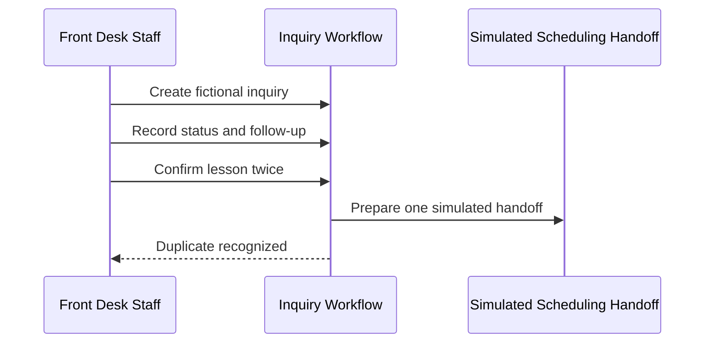
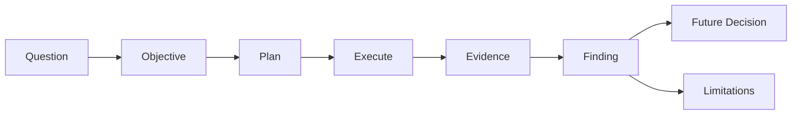

# Chapter 15 — Technical Demonstrations and Proofs of Concept

## Research Foundations

This chapter applies experimental thinking: state a falsifiable question, control the scenario,
record observations, and bound the inference. Requirements, acceptance criteria, and recommendation
conditions are the existing evidence chain; a demo does not replace them. The suggested reading
lists established primary standards and books rather than invented citations.

## Professional Practice

A technical demonstration should answer a defined question, not merely display features. A Sales
Engineer discloses scripted inputs, preconditions, exclusions, failure paths, and unresolved facts.
Failed and inconclusive findings are useful evidence and must not be hidden.

## Educational Heuristic

Use **question → objective → plan → execution → evidence → finding → limitation → later decision**.
`INCONCLUSIVE != FAILED`, and a passed demonstration is not approval or production readiness.

## Subjective Professional Judgment

Judgment selects which uncertainty matters, which evidence is proportionate, and who should review
it. Code can validate plan coherence and execute the authored scenario; it cannot decide that the
customer should proceed or substitute a scripted run for stakeholder acceptance.

## Learning Objectives

After this chapter, learners can distinguish lifecycle artifacts; define objective, audience, test
data, success and failure; trace evidence; separate observation from interpretation; identify demo
theatre; and explain why a demonstration does not prove production readiness.

## Why Demonstrations Exist

Weak: “Show the customer the new system.” Better: “Given a fictional active inquiry, when
front-desk staff record status and follow-up, then confirm it twice, can current state and ordered
history be retrieved while only one scheduling handoff is prepared?” The second is observable,
traceable, and capable of failing.

## Product Demo vs. Solution Demo

A **product demonstration** shows what an existing product can do. A **solution demonstration**
shows how selected capabilities may support a customer workflow. Neither necessarily tests an
unresolved technical feasibility question.

## Prototype vs. Proof of Concept

A **prototype** is a preliminary representation for exploring behavior or design. A **proof of
concept** tests whether a specific technical or operational idea is feasible. Therefore:

- `DEMO != PROOF_OF_CONCEPT`
- `PROOF_OF_CONCEPT != PILOT`
- `PILOT != PRODUCTION`

## Pilot vs. Production

A **pilot** is a limited real-world deployment that gathers operational evidence. A **production
implementation** is supported for ongoing use. This laboratory supplies neither: it has fictional
data, an in-memory handler, and a simulated scheduling boundary.

## Defining the Question

The objective names the question, actors, scenario, action, observable result, evidence, and traced
requirements or conditions. `validate_demonstration_plan` rejects known vague wording, missing
traceability, unsupported steps, and scope-exceeding claims.

## Audience and Scope

Front Desk Staff validate workflow fit; the Store Manager evaluates the operational need; and the
Music Instructor inspects the represented handoff. Attendance is not assumed. The scope is current
status, ordered history, a simulated handoff, and sequential duplicate suppression.

Exclusions are enterprise scalability, certification, compliance, production reliability, vendor
compatibility, exact financial benefits, full adoption, and long-term maintainability.

## Success and Failure Conditions

Success is observable: retrieve status, preserve chronological history, produce one handoff, and
produce no additional effect for a repeated logical confirmation. Failure is explicit: status is
indeterminate, history is out of order, duplicate effects occur, or evidence is not traceable.

## Scenario Data

`INQ-DEMO-001` represents a fictional learner requesting Guitar on Tuesday afternoon. The selected
time and fictional instructor are fixed. No production data, real time, or randomness is used.

## Evidence Artifacts

The run produces structured state, transition history, a handoff count, duplicate validation,
traceability records, deterministic console/Markdown output, and Mermaid diagrams. These
reproducible text artifacts are preferable to an unrepeatable screenshot.

## Observations vs. Interpretations

**Observed:** the second confirmation did not create a second scheduling record. **Interpretation:**
duplicate suppression operates in this educational handler. **Limitation:** sequential in-memory
behavior does not prove concurrency or external retry behavior. These remain separate fields.

## Demonstration Findings

- **PASSED:** the defined evidence satisfies the condition for this scenario.
- **FAILED:** observed evidence meets a stated failure condition.
- **PARTIALLY_DEMONSTRATED:** some, but not all, scoped evidence exists.
- **NOT_DEMONSTRATED:** the plan did not execute the condition.
- **INCONCLUSIVE:** evidence cannot distinguish the relevant outcomes; it is not automatically failed.

## Recommendation-Condition Coverage

| Chapter 14 condition | Coverage | Finding |
|---|---|---|
| RC-001 define statuses and handoff | Status and handoff demonstrated | Passed |
| RC-002 assign ownership and editors | Responsibility represented; ownership unresolved | Partial |
| RC-003 verify authorized access | Roles represented; real access unverified | Partial |
| RC-004 define baseline success measures | Not measured | Not demonstrated |
| RC-005 investigate calendar integration | Duplicate behavior only; POC planned | Partial |

One demonstration rarely validates every recommendation condition.

## Requirement Coverage

| Requirement | Step | Evidence | Finding |
|---|---|---|---|
| REQ-001 current status | STEP-005 | EV-STATE | Passed |
| REQ-002 instructor schedule visibility | STEP-007 | EV-HANDOFF | Partially demonstrated |
| REQ-003 unapproved budget constraint | — | — | Not demonstrated |

Passing a few requirements does not validate the full solution.

## Demo Theatre

A scripted presentation can avoid failure paths, unknowns, or unsupported assumptions. Guardrails
flag missing failure conditions, limitations, traceability, evidence, disclosed preconditions,
production-readiness claims, and unsupported steps. Scripted success is not independent validation.

## Production-Readiness Limits

The only permitted conclusion is: **Demonstration objective satisfied for the defined deterministic
scenario. Production readiness requires broader evidence.** Passing does not set `production_ready`.

## Harbor Street Music Walkthrough

The run creates the fictional inquiry, assigns staff responsibility, records `NEW`, records a
follow-up, retrieves history, confirms with required data, prepares a simulated handoff, repeats the
confirmation, and verifies one effect. It directly reuses `REQ-001`, `REQ-002`, their acceptance
criteria, Chapter 4 role identifiers, and Chapter 14 `RC-001` through `RC-005`.

## Mermaid Diagrams

Findings inform a future decision; they do not approve implementation.

## Executable Experiments

`duplicate_confirmation_experiment` records one created handoff, one recognized duplicate, and zero
additional effects. `missing_information_experiment` removes selected time from an immutable copy,
records failed validation and zero handoffs, and leaves the canonical scenario unchanged.
`unsupported_claim_experiment` flags the claim that the demo proves increased lesson revenue.

Calendar interface feasibility is `POC-001 / NOT_EXECUTED`. A supported test environment,
authorization, logs, and resulting records are required. The lab does not fabricate compatibility.

## Debugging Laboratory

Run `python examples/debug_chapter_15.py` or **Debug Chapter 15 Demonstration**. Step through
recommendation condition → objective → scenario → steps → observed results → finding → limitation.
Inspect `demonstration_plan`, `objective`, `scenario`, `steps`, `state`, `evidence_artifacts`,
`observed_results`, `findings`, `limitations`, and `coverage` rather than relying on line numbers.

## Exercises

### Exercise A

Twenty features have no requirement links. What is missing? **A focused objective and traceability
to customer needs.**

### Exercise B

A script succeeds once. Does it prove production reliability? **No.**

### Exercise C

Testing whether a calendar supports an integration mechanism is what type? **Proof of concept.**

### Exercise D

Status tracking is tested but integration is not. Is the full recommendation validated? **No.**

### Exercise E

A duplicate confirmation creates another scheduling effect. What was learned? **The duplicate-
handling condition failed; preserve that finding.**

### Exercise F

The technical demo works, but no future user reviewed it. What remains? **Workflow fit, usability
feedback, stakeholder acceptance, operational readiness, training, and ownership evidence.**

## Chapter Summary

We now have reproducible evidence showing which recommendation conditions were demonstrated, which
failed, and which remain unresolved.

The next question is: **How should the Sales Engineer package the evidence, recommendation, scope,
assumptions, and next steps for decision-makers?** That belongs in Chapter 16.

## Glossary

**Demonstration:** scoped showing tied to an objective. **Prototype:** preliminary representation.
**Proof of concept:** feasibility test. **Pilot:** limited real-world deployment. **Observation:**
recorded fact. **Interpretation:** bounded meaning assigned to a fact. **Demo theatre:** scripted
appearance of completeness that conceals uncertainty. **Exclusion:** claim outside tested scope.

## References / Suggested Reading

- ISO/IEC/IEEE 29148:2018, *Requirements Engineering*.
- ISO/IEC/IEEE 15288:2023, *System Life Cycle Processes*.
- National Institute of Standards and Technology, *Guide for Conducting Risk Assessments*, SP 800-30 Rev. 1.
- Karl Wiegers and Joy Beatty, *Software Requirements*, 3rd edition, Microsoft Press, 2013.
- Jez Humble and David Farley, *Continuous Delivery*, Addison-Wesley, 2010.
