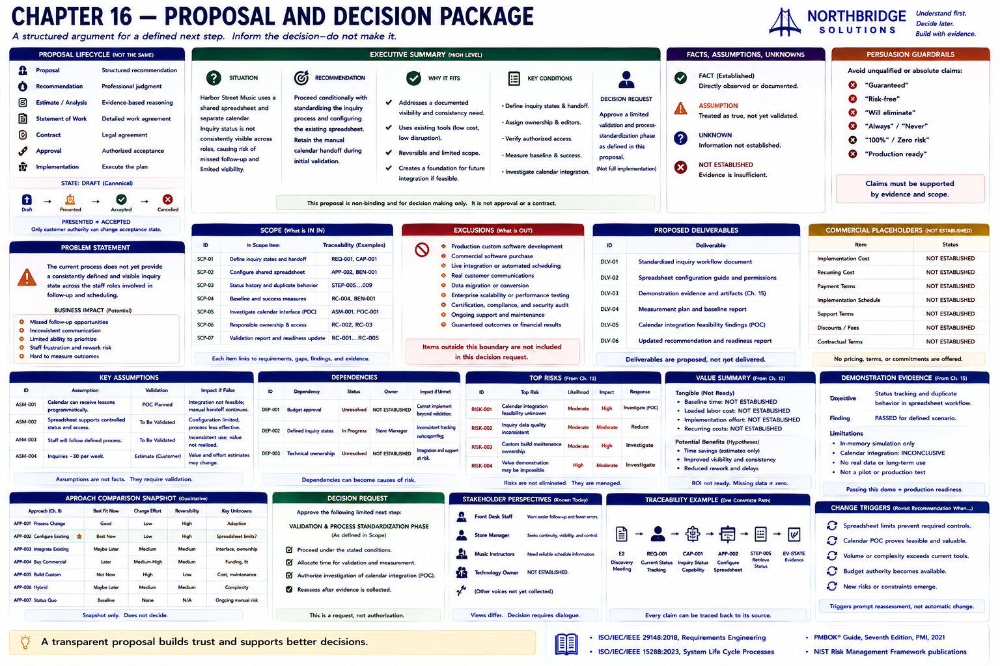
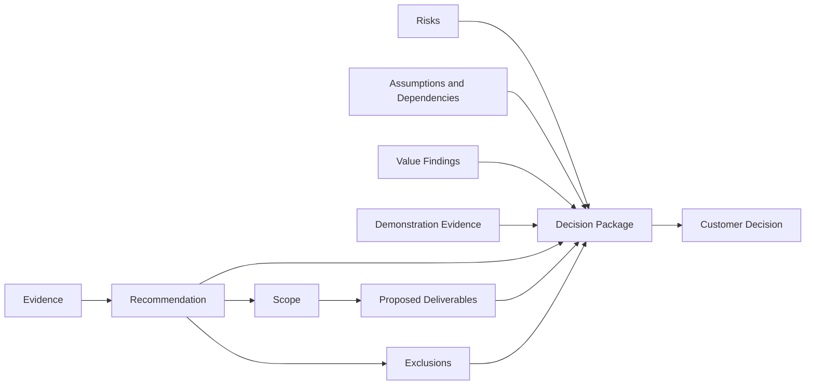

# Chapter 16 — Proposal and Decision Package

## Research Foundations

This chapter applies requirements traceability, decision records, risk registers, and evidence-based reasoning already introduced in Chapters 5–15. Suggested reading appears below; the laboratory does not claim a universal proposal standard.

## Professional Practice

A proposal is a structured argument for a defined next step. It explains the situation, evidence, recommendation, boundary, unknowns, conditions, risks, dependencies, and decision without manufacturing certainty.

## Educational Heuristic

**Evidence → recommendation → bounded scope → proposed deliverables → decision request.** The package informs a human decision; it does not make it.

## Subjective Professional Judgment

Selecting relevant evidence, deciding how much detail each audience needs, and articulating acceptable tradeoffs require disclosed professional judgment. They are not hidden scores.

## Learning Objectives

Learners will structure executive summaries; distinguish fact, assumption, and unknown; trace scope; state exclusions; reuse risk and value evidence; disclose commercial unknowns; and avoid unsupported promises.

## Purpose of a Proposal

The proposal makes a conditional recommendation understandable and reviewable. Proposal, recommendation, estimate, statement of work, contract, approval, and implementation are distinct artifacts or events.

## Proposal vs. Contract

This recommendation package is non-binding. It contains no legal terms, binding pricing, implementation authorization, or customer acceptance. **PROPOSAL != CONTRACT** and **RECOMMENDATION != APPROVAL**.

## Executive Summary

The concise summary states the current spreadsheet/calendar situation, the inconsistent inquiry-state problem, the limited existing-tool direction, why it fits current evidence, the important conditions, and the requested validation decision.

## Problem Statement

The process does not yet provide a consistently defined and visible inquiry state across the staff roles involved in follow-up and scheduling. This is narrower and better supported than the symptom “students are slipping through the cracks.”

## Recommendation

Chapter 14 conditionally recommends standardizing the inquiry process and configuring the shared spreadsheet while retaining the manual calendar handoff during validation. Larger technology choices remain alternatives, not rejected forever.

## Scope

Scope defines statuses and ownership, configures the existing artifact, validates status history and duplicate behavior, collects baselines, and investigates the calendar interface separately. Every item links to requirements, capabilities, recommendation or demonstration findings, and evidence.

## Exclusions

Production custom software, commercial purchase, live integration, real communications, migration, certification, performance testing, support, and guaranteed outcomes are outside this decision boundary.

## Deliverables

Workflow, tracking configuration, demonstration evidence, measurement plan, feasibility findings, and an updated readiness recommendation are **proposed deliverables**. They have not been delivered.

## Assumptions

The Chapter 13 calendar-interface premise remains unvalidated. Its validation action and consequence if false remain visible rather than becoming a fact.

## Dependencies

Budget approval, defined process states, and technical ownership retain their original statuses, resolution actions, and consequences.

## Risks

Cause–event–consequence statements and planned responses remain inspectable. No aggregate score disguises uncertainty.

## Value Summary

Chapter 12 establishes that no new cost is established, identifies missing effort and outcome measures, and offers visibility and consistency hypotheses. ROI is **not ready**; missing pricing is not zero. Illustrative sensitivity scenarios are not Harbor Street Music facts.

## Demonstration Evidence

Chapter 15 passed state/history retrieval and sequential duplicate suppression, partially represented the scheduling handoff, and left real calendar feasibility inconclusive. Security, scale, reliability, adoption, and production readiness were not tested.

## Commercial Placeholders

Pricing, payment terms, implementation schedule, support terms, and contractual commitments display **NOT ESTABLISHED**. This is transparent information, not an error.

## Decision Requests

The package asks for approval of a limited validation and process-standardization phase—not unpriced production implementation.

## Executive vs. Technical Views

Both views derive from one immutable package. The executive view emphasizes situation, scope, value, risk, and decision; the technical view exposes identifiers, architecture boundaries, integration questions, conditions, and demonstration coverage. Their conclusion cannot drift.

## Proposal Lifecycle

The canonical package is `DRAFT`. `PRESENTED != ACCEPTED`; only explicit customer authority can change acceptance state.

## Persuasion Guardrails

A small deterministic rule flags phrases such as “guaranteed,” “risk-free,” “will eliminate,” and “production ready” for review. It never silently rewrites the author’s statement.

## Harbor Street Music Walkthrough

Run `sales-lab proposal`. Read established, assumed, and unknown situation entries; follow scope IDs to prior evidence; inspect commercial placeholders; then verify that the requested decision matches the limited scope.

## Traceability

The generated matrix links each proposal item to requirement, capability, recommendation finding, and evidence identifiers. Missing links produce validation findings rather than disconnected prose.

## Mermaid Diagram

The arrow means “informs,” not “automatically approves.”

## Executable Experiments

The pricing experiment supplies fictional implementation, recurring, and payment assumptions under **EXPERIMENTAL COMMERCIAL SCENARIO** while preserving the original. The scope experiment exposes an unsupported mobile-app deliverable. The promise experiment flags “will eliminate missed inquiries.”

## Debugging Laboratory

Run `python examples/debug_chapter_16.py`. Step through `proposal`, `executive_summary`, `scope`, `exclusions`, `deliverables`, `risks`, `assumptions`, `commercial_placeholders`, `decision_request`, and `validation_findings` from recommendation through validation.

## Exercises

### Exercise A
A limited validation proposal requests full production approval. What is wrong? **The request exceeds its scope and evidence.**

### Exercise B
Pricing is unknown. Display `$0`? **No: display NOT ESTABLISHED.**

### Exercise C
“The new process will eliminate missed inquiries.” **This absolute outcome is unsupported.**

### Exercise D
A mobile application appears without recommendation evidence. **This is unsupported scope expansion.**

### Exercise E
A proposal was presented. Is it accepted? **Not necessarily.**

### Exercise F
Why state exclusions? **To prevent misunderstanding, define the decision boundary, expose unresolved work, reduce accidental commitments, and improve handoff.**

## Chapter Summary

We now have a transparent proposal and decision package that communicates the recommendation without inventing approval, pricing, or promised outcomes.

The next question is: **What must be transferred from the Sales Engineering team to the delivery team before implementation can responsibly begin?** That belongs in Chapter 17.

## Glossary

- **Proposal:** non-binding structured argument for a next step.
- **Placeholder:** explicit unresolved commercial information.
- **Decision request:** bounded action submitted to an identified authority.
- **Exclusion:** work explicitly outside the proposal boundary.
- **Traceability:** inspectable links from proposal claims to prior findings.

## References / Suggested Reading

- ISO/IEC/IEEE 29148, *Requirements Engineering*.
- Michael Quinn Patton, *Principles-Focused Evaluation*.
- Douglas W. Hubbard, *How to Measure Anything*.
- National Institute of Standards and Technology, *Risk Management Framework* publications.
