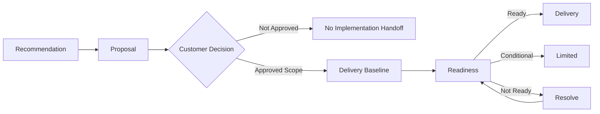
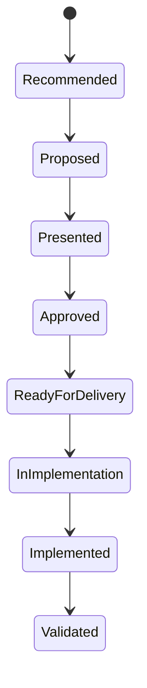

# Chapter 17 — Implementation Handoff and Delivery Readiness

## Research Foundations

This chapter applies requirements baselines, architecture decision records, verification and validation, responsibility assignment, configuration control, and risk management. The suggested reading names established sources; the laboratory does not claim one universal handoff method.

## Professional Practice

An implementation handoff gives delivery an evidence-linked boundary, open questions, responsibilities, and a way to validate completion. A recommendation is not an implementation plan, and an accepted proposal is not automatically delivery-ready.

## Educational Heuristic

**Approved boundary + baselines + feasible dependencies + accountable roles + acceptance plan → responsible delivery start.** No numeric score replaces inspection of mandatory conditions.

## Subjective Professional Judgment

Teams judge which conditions are mandatory for a particular scope and whether limited work can safely proceed. The judgment must name its evidence, affected scope, and consequences rather than hide behind “82% ready.”

## Learning Objectives

Learners will distinguish lifecycle states; baseline requirements and architecture; separate proposed from approved scope; identify decisions, discovery, ownership, dependencies, and unsupported commitments; define acceptance; control change; and build a traceable handoff.

## Why Handoffs Fail

Handoffs fail when proposal language is mistaken for authorization, candidate designs become “final” by repetition, demonstration limits disappear, owners are invented, and delivery inherits promises that have neither evidence nor scope traceability.

## Presales vs. Delivery Responsibilities

Sales Engineering transfers the reasoning, evidence, recommendation, proposed boundary, risks, and limitations. Delivery confirms the authorized baseline, completes engineering discovery, plans and implements work, records changes, and creates validation evidence. Neither side may manufacture customer approval.

## Lifecycle States

`RECOMMENDED`, `PROPOSED`, `PRESENTED`, `APPROVED`, `READY_FOR_DELIVERY`, `IN_IMPLEMENTATION`, `IMPLEMENTED`, and `VALIDATED` are distinct. In particular:

- `RECOMMENDED != APPROVED`
- `APPROVED != READY_FOR_DELIVERY`
- `READY_FOR_DELIVERY != IMPLEMENTED`
- `IMPLEMENTED != VALIDATED`

The canonical package is `PROPOSED`; the Chapter 16 proposal is still a draft.

## Proposed vs. Approved Scope

Every Chapter 16 scope item enters the handoff as `PROPOSED`. None enters `APPROVED` without an explicit approval event. Deferred, rejected, and under-review states preserve later decisions without erasing history.

## Delivery Readiness

`READY` means every mandatory condition for the defined scope is satisfied. `CONDITIONALLY_READY` permits only a named limited boundary. `NOT_READY` has unmet mandatory conditions. `ON_HOLD` records an intentional pause. `NOT_EVALUATED` means no assessment occurred. These are qualitative governance states, not percentages.

## Requirements Baseline

`HSM-REQ-BASELINE-v1` transfers Chapter 5 requirement and acceptance identifiers, evidence sources, and unresolved areas. Baselining does not freeze learning; it makes changes visible and traceable.

## Architecture Baseline

`ARCH-001` remains a candidate. Logical workflow, data, spreadsheet, calendar, and information flows are known, while access control and the calendar mechanism remain unresolved physical choices.

## Integration and Automation Readiness

Calendar feasibility requires validation; no API or vendor feature is invented. Duplicate and failure expectations remain visible. Chapter 11 modes, human accountability, approval boundaries, exceptions, data dependencies, and readiness transfer unchanged. A not-ready activity cannot silently enter delivery scope.

## Acceptance Baseline

Chapter 5 criteria are mapped to stakeholder-observed scenarios and future acceptance records. The validating role is not established. Chapter 15 evidence informs engineering, but `DEMONSTRATION_RESULT != CUSTOMER_ACCEPTANCE`; production concurrency, security, scale, and reliability remain unproven.

## Ownership and Responsibility

The educational responsibility model uses `ACCOUNTABLE`, `RESPONSIBLE`, `CONSULTED`, `INFORMED`, and `NOT_ESTABLISHED`. Business process, solution decision, technical delivery, integration, data, acceptance, training, maintenance, and support begin without evidenced owners. Roles, not invented names, resolve gaps.

## Technical Discovery

Calendar capability and production duplicate identification are pre-implementation questions because they affect feasibility. Spreadsheet access control can be investigated within a safely bounded implementation activity. Mandatory feasibility is not casually deferred.

## Blocking Conditions

The canonical assessment is `NOT_READY`: scope is unapproved, the candidate architecture is unreviewed, essential owners and acceptance authority are absent, calendar feasibility is unresolved, change authority is unknown, and risk acknowledgement is unrecorded. Formatting refinement is explicit non-blocking follow-up.

## Change Control

A clarification improves wording without changing required behavior. New behavior—such as a native mobile application with no requirement or proposal link—is a scope change. The boundary says who may approve, which trace links change, and which acceptance criteria require revision; the approval role is currently unknown.

## Presales Commitment Risk

Deterministic guardrails flag claims such as “integration in two weeks,” “unlimited users,” “all historical data will be migrated,” and “eliminate scheduling errors.” Unsupported commitments are findings, never implementation inputs.

## Handoff Artifacts

The package transfers only repository artifacts: discovery summary, current-state process, requirements baseline, selected recommendation, demonstration findings, and Chapter 16 scope and exclusions. Each identifies its chapter, consumer, status, and limitation.

## Harbor Street Music Walkthrough

Run `sales-lab handoff`. Compare all six proposed scope items with the empty approved-scope section. Inspect the unresolved calendar decision, role gaps, acceptance baseline, readiness checklist, and next actions. `NOT_READY` is disciplined governance, not analytical failure.

## Checklist

The generated table names each condition, status, evidence, blocking effect, and next action. It never calculates percentage complete.

## Traceability

The retained chain is **discovery evidence → requirement → capability → approach → recommendation → proposal scope → delivery baseline → implementation work → acceptance evidence**. It answers “why is this in scope?” and “how will completion be observed?”

## Mermaid Diagrams

## Executable Experiments

The approval experiment fictionally approves a limited subset; readiness becomes conditional while technical and ownership blockers remain. The owner experiment assigns organizational roles and resolves only ownership and validation-role findings. The mobile experiment flags unsupported scope without mutating the original. Failed calendar feasibility defers only `SCOPE-006`; unrelated scope remains unchanged.

## Debugging Laboratory

Run `python examples/debug_chapter_17.py` or **Debug Chapter 17 Handoff**. Follow `handoff`, `lifecycle_status`, `scope_items`, `approval_status`, `requirements_baseline`, `architecture_baseline`, `integration_readiness`, `responsibilities`, `readiness_conditions`, `blocking_findings`, and `next_actions` through the package.

## Exercises

**A.** Presented, no approval: can implementation begin? **No; presentation is not approval.**

**B.** Scope approved, essential interface unverified: automatically ready? **No; approval and technical readiness differ.**

**C.** Demonstration passed: customer accepted? **No.**

**D.** An unapproved mobile app appears: **treat it as a potential scope change requiring explicit review and approval.**

**E.** Custom system approved, no maintenance owner: **delivery and operational readiness are affected.**

**F.** Why baseline requirements? **Preserve the boundary and traceability, expose change, support acceptance, and reduce misunderstanding.**

**G.** Can work start with noncritical details open? **Possibly, when explicitly non-blocking and the permitted boundary remains safe and clear.**

## Chapter Summary

We now understand what delivery can begin, what remains blocked, who is responsible, and how implementation will be validated.

After implementation, how will the organization determine whether the solution produced the intended outcome? That belongs in Chapter 18.

## Glossary

**Baseline:** A versioned, traceable reference boundary. **Readiness condition:** An evidenced prerequisite for a delivery boundary. **Acceptance baseline:** Criteria, method, role, and evidence expected for validation. **Change control:** Making alterations explicit, authorized, and traceable. **Technical discovery:** Evidence gathering needed to establish implementation detail or feasibility.

## References / Suggested Reading

- ISO/IEC/IEEE 29148, *Requirements Engineering*.
- ISO/IEC/IEEE 15288, *System Life Cycle Processes*.
- ISO/IEC/IEEE 12207, *Software Life Cycle Processes*.
- NIST SP 800-160 Volume 1, *Engineering Trustworthy Secure Systems*.
- Michael Nygard, “Documenting Architecture Decisions.”
