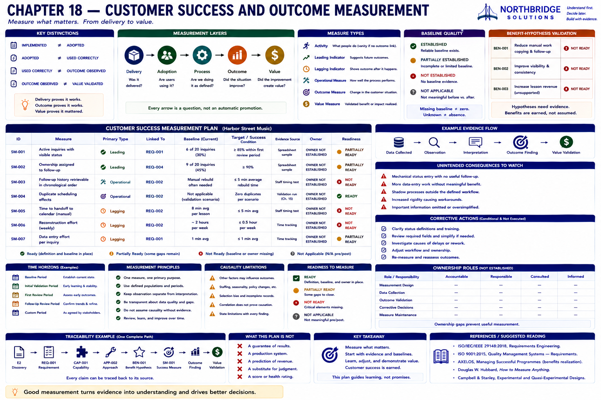
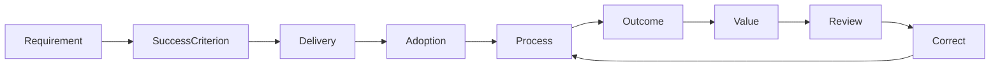
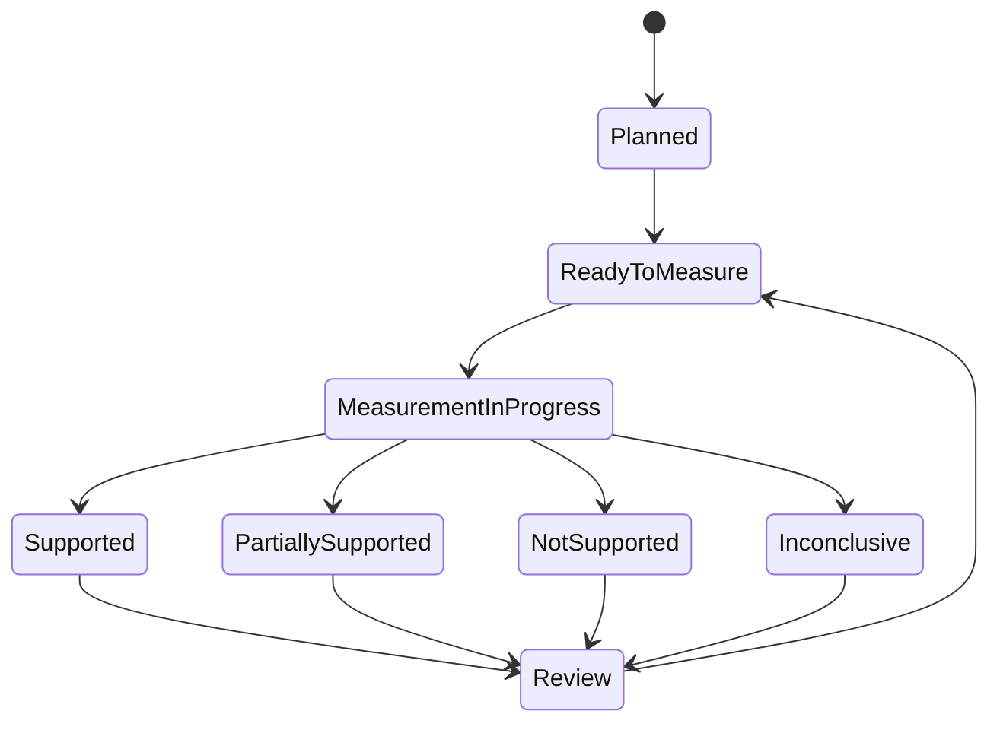

# Chapter 18 — Customer Success and Outcome Measurement

## Research Foundations

This chapter draws on requirements traceability, measurement theory, benefits realization, process improvement, program evaluation, and causal reasoning. The suggested reading identifies established sources; the laboratory does not claim a universal customer-success method.

## Professional Practice

A responsible plan says what will be measured, against which baseline, during which supplied period, from what evidence, and by which role. It keeps observation separate from interpretation and value validation.

## Educational Heuristic

**Delivery evidence → adoption evidence → process evidence → outcome evidence → value validation.** Each arrow is a question, not an automatic promotion. The categories are educational rather than universal and one measure has one primary purpose.

## Subjective Professional Judgment

Teams must choose relevant populations, periods, exclusions, exception treatment, and corrective thresholds. Judgment is transparent when assumptions and limitations are visible; it is not improved by a hidden health score.

## Learning Objectives

Learners will distinguish implementation from customer success; define honest baselines, targets, sources, periods, and ownership; connect measures to requirements and benefits; distinguish leading, lagging, activity, adoption, operational, outcome, and value evidence; inspect unintended effects and causality; and plan corrective review.

## Implementation vs. Customer Success

`DELIVERED`, `IMPLEMENTED`, `AVAILABLE`, `ADOPTED`, `USED_CORRECTLY`, `OPERATIONALLY_EFFECTIVE`, `OUTCOME_OBSERVED`, and `VALUE_VALIDATED` are distinct:

- `IMPLEMENTED != ADOPTED`
- `ADOPTED != USED_CORRECTLY`
- `USED_CORRECTLY != OUTCOME_OBSERVED`
- `OUTCOME_OBSERVED != VALUE_VALIDATED`

Harbor Street Music remains `PROPOSED` and `NOT_READY` after Chapter 17. This chapter therefore creates a **Customer Success Measurement Plan**, not customer-success results.

## Measurement Layers

A **delivery** measure asks whether an artifact exists. **Adoption** asks whether intended users use it. **Process** asks whether work follows the definition. **Outcome** asks whether the customer situation changed. **Value** asks whether that outcome created validated benefit. Delivery must not skip directly to value.

## Acceptance Criteria vs. Success Measures

An acceptance criterion verifies specified behavior—for example, an authorized staff member can retrieve a recorded status. A success measure observes operational performance over a period—for example, whether active inquiries without visible status decline from an established baseline. `ACCEPTANCE_CRITERION != SUCCESS_MEASURE`; acceptance may be necessary but is insufficient for success.

## Baselines

`ESTABLISHED`, `PARTIALLY_ESTABLISHED`, `NOT_ESTABLISHED`, and `NOT_APPLICABLE` preserve what is known. **Missing baseline != zero.** Status coverage, ownership visibility, follow-up order, handoff effort, reconstruction effort, and data-entry effort need supplied samples. Duplicate-effect validation is `NOT_APPLICABLE` to before/after comparison because its target belongs to an explicitly deterministic validation scenario.

## Leading and Lagging Indicators

Status and owner coverage are leading indicators: they suggest that the process may support later outcomes, but guarantee nothing. Reconstruction effort, handoff time, and scheduling discrepancies are lagging indicators. Timing is explicit on each measure.

## Activity vs. Outcome

Logins and spreadsheet openings are activity evidence, not customer success. Status updates may inform adoption, but their count alone does not demonstrate better inquiry handling. The service flags activity-only measures as potential vanity metrics when they lack an operational-outcome link.

## Adoption

Adoption asks whether intended roles use the process or capability. `SM-001` measures status coverage over a defined sample. It does not imply that notes are useful, follow-up is correct, scheduling is efficient, or value exists.

## Operational Effectiveness

`SM-002` checks visible responsibility, `SM-003` checks retrievable chronological history, and `SM-004` checks duplicate scheduling effects. These measures connect use to the defined workflow without claiming production operations occurred.

## Value Realization

Value may be time reduction, less rework, visibility, consistency, reduced risk, improved decisions, or flexibility. Not every value becomes currency. Chapter 12's time hypotheses remain opportunity or capacity hypotheses until measured; staff time is not automatically cash savings.

## Benefit-Hypothesis Validation

The plan reuses `BEN-001`, `BEN-002`, and even unsupported `BEN-003`. Each retains its required baseline, follow-up measure, evidence state, result, validation state, and limitation. Canonical states remain `NOT_READY`; no benefit is validated by a proposal or demonstration.

## Measurement Ownership

Collection, review, outcome validation, corrective decisions, and measure maintenance need evidenced stakeholder roles. Earlier artifacts establish no measurement owners, so the plan says `OWNER_NOT_ESTABLISHED`. Missing ownership is a finding, not an invitation to invent a person.

## Observation Periods

`BASELINE_PERIOD`, `INITIAL_VALIDATION_PERIOD`, `FIRST_REVIEW_PERIOD`, `FOLLOW_UP_REVIEW_PERIOD`, and `CUSTOM` represent time without reading a clock. The canonical plan uses stable identifiers such as `HSM-FIRST-REVIEW`; an authorized team must still agree the operational boundaries.

## Unintended Consequences

The plan monitors mechanical status entry, additional data-entry work, and shadow systems. These have **not occurred** canonically. Monitoring prevents local improvement from hiding burden, noise, rigidity, incomplete information, or workarounds.

## Corrective Actions

Actions are conditional and unexecuted. If inconsistent status usage meets an agreed review condition, clarify definitions and training. If entry effort rises without compensating operational gain, review required fields and simplify the boundary. Decision ownership remains unestablished.

## Causality Limitations

An outcome observed during a review period does not prove the solution caused it. Staffing, seasonality, policy changes, selection effects, and incomplete records can offer alternative explanations. The unclear-causality experiment therefore reports `OUTCOME_OBSERVED` with `INCONCLUSIVE` attribution.

## Harbor Street Music Walkthrough

Run `sales-lab success`. Seven measures cover status, ownership, history, duplicates, handoff effort, reconstruction effort, and data-entry burden. `SM-004` is ready for its deterministic validation boundary. Others are partially ready or not ready because operational baselines and owners are absent. No missed-inquiry reduction, approval, implementation, adoption, or realized value is claimed.

## Measurement Matrix

The generated matrix displays measure, primary type, requirement, baseline, evidence source, owner, and qualitative readiness. It contains no percentage, health score, or hidden ranking.

## Traceability

The deterministic view preserves **discovery evidence → requirement → success criterion → recommendation → implementation scope → success measure → baseline → observed evidence → outcome finding → value validation → corrective action**. Canonical observation cells say `NOT_OBSERVED`; experiments stay separate.

## Mermaid Diagrams

The loop supports learning and adjustment rather than guaranteed progress.

## Executable Experiments

Run `sales-lab success --scenario experimental`. Every review is labeled `EXPERIMENTAL_MEASUREMENT_SCENARIO` and leaves the plan unchanged.

1. **Positive evidence:** status coverage moves from 6/20 (30%) to 18/20 (90%): 12 more inquiries and 60 percentage points. The small fictional sample does not prove efficiency, revenue, implementation success, or causality.
2. **Adoption without outcome:** status coverage is consistent while handoff effort stays eight minutes. Adoption improved; the efficiency benefit was not demonstrated.
3. **Unclear causality:** reconstruction effort falls while staffing changes. The outcome is observed; attribution is `INCONCLUSIVE`.
4. **Unintended consequence:** status coverage improves while average entry effort rises from one to three minutes. The intended outcome and unintended cost coexist, value remains conditional, and corrective review is required.

## Debugging Laboratory

Run `python examples/debug_chapter_18.py` or select **Debug Chapter 18 Customer Success**. Step through requirement → success criterion → success measure → baseline → observed evidence → outcome finding → value validation. Inspect `measurement_plan`, `measures`, `baseline`, `target_condition`, `evidence_source`, `owner`, `observations`, `outcome_findings`, `benefit_validation`, `unintended_consequences`, and `corrective_actions`.

## Exercises

**Exercise A.** The solution was deployed successfully. Has customer value been validated? **No.**

**Exercise B.** Every staff member logged in. Does that prove process improvement? **No. Login activity is an adoption or activity indicator, not an outcome.**

**Exercise C.** Status usage increased, but scheduling time did not decrease. What follows? **Adoption improved, but the efficiency benefit was not demonstrated.**

**Exercise D.** Follow-up improved while staffing increased. Can the solution receive all credit? **No. Causal attribution remains uncertain.**

**Exercise E.** No reconstruction-time baseline exists. Is the prior value zero? **No. Missing is unknown, not zero.**

**Exercise F.** Why monitor unintended consequences? **Improvements may create burden, workarounds, noise, rigidity, or harm elsewhere; value must consider intended and unintended effects.**

## Chapter Summary

We now have a transparent plan for distinguishing delivery, adoption, operational outcomes, and validated value.

The final Volume I question is: **Can the complete engagement be executed from initial customer statement through recommendation, handoff, and outcome-measurement planning while preserving one traceable evidence chain?** That belongs in Chapter 19.

## Glossary

**Baseline:** Comparison evidence established before interpreting change. **Leading indicator:** Evidence suggesting a process may support later outcomes. **Lagging indicator:** Evidence of a later result. **Success measure:** A defined operational observation linked to an intended outcome. **Value validation:** Evidence that an observed outcome created a supported benefit. **Unintended consequence:** A possible or observed effect outside the intended improvement. **Corrective action:** A conditional response requiring a decision.

## References / Suggested Reading

- ISO/IEC/IEEE 29148, *Requirements Engineering*.
- ISO 9001, *Quality management systems — Requirements*.
- AXELOS, *Managing Successful Programmes* (benefits realization guidance).
- Douglas W. Hubbard, *How to Measure Anything*.
- Donald T. Campbell and Julian C. Stanley, *Experimental and Quasi-Experimental Designs for Research*.
